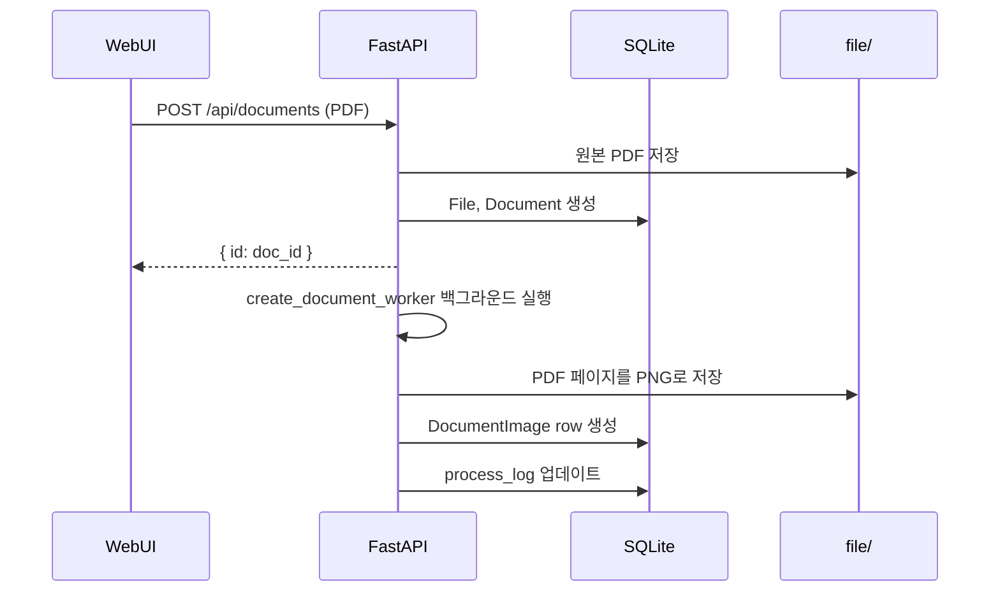
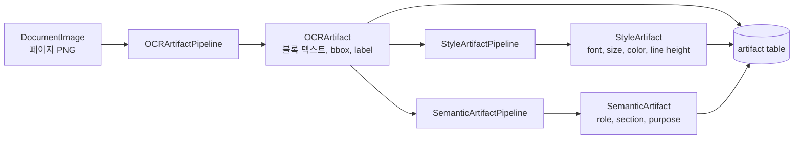
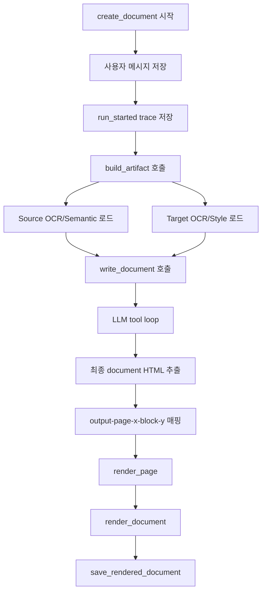
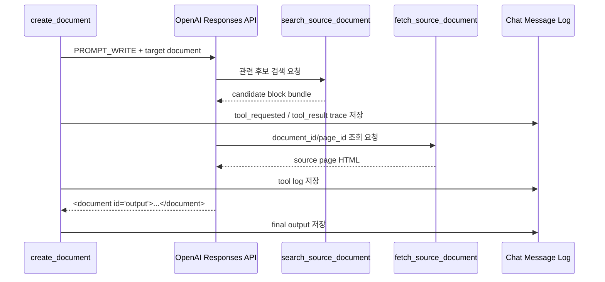
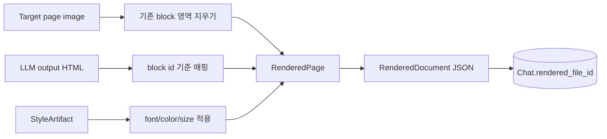
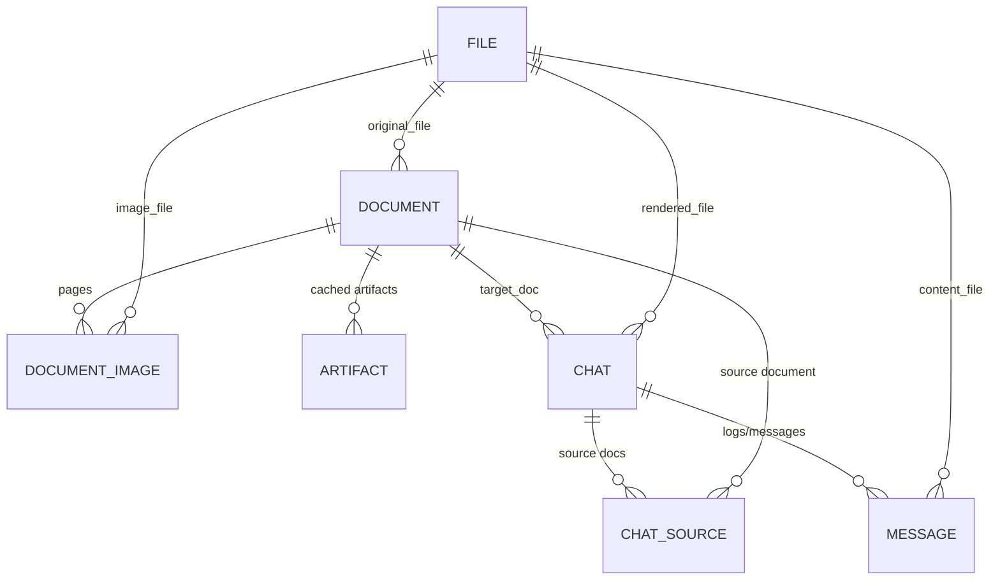

# 18. UI 통합 시작

## 목적

이 문서는 `llm2doc` 백엔드 코드를 UI와 통합하기 위해 필요한 흐름을 정리한다. 핵심은 사용자가 문서를 업로드하고, 소스 문서와 타깃 문서를 선택한 뒤, 쿼리를 입력하면 서버가 문서 생성 작업을 백그라운드로 수행하고 WebUI가 진행 상태와 최종 렌더 결과를 조회하는 구조다.

현재 구현은 문서 업로드, 채팅 생성, 결과 렌더 조회 API가 이미 존재한다. 다만 UI에서 자연스럽게 쓰기 위해서는 문서 목록, 생성 요청, 진행 로그, 최종 렌더 표시를 하나의 사용자 흐름으로 묶어야 한다.

## 현재 구조 요약

`llm2doc`는 크게 5개 층으로 나뉜다.

| 영역 | 주요 파일 | 역할 |
| --- | --- | --- |
| API 서버 | `llm2doc/server.py` | FastAPI 앱, DB/thread pool lifespan, 라우터 등록 |
| 라우트 | `llm2doc/route/*.py` | 문서 업로드/조회, 채팅 생성/조회, 폰트 API |
| DB 계층 | `llm2doc/entity/*.py`, `llm2doc/repository/*.py` | SQLAlchemy entity와 CRUD 함수 |
| Artifact 파이프라인 | `llm2doc/artifact/*` | OCR, 스타일, 시맨틱 분석 결과 생성/캐싱 |
| 문서 생성 | `llm2doc/create_document.py` | LLM 도구 호출, 최종 HTML-ish 문서 생성, 렌더 JSON 저장 |

## 전체 실행 흐름

```mermaid
flowchart TD
    A[사용자] --> B[WebUI]
    B --> C[문서 업로드 API<br/>POST /api/documents]
    C --> D[원본 파일 저장<br/>file/{uuid}]
    D --> E[PDF 페이지 이미지화<br/>DocumentImage 생성]
    E --> F[문서 목록 조회<br/>GET /api/documents]

    B --> G[채팅 생성 API<br/>POST /api/chats]
    G --> H[Chat row 생성]
    H --> I[백그라운드 create_document 시작]

    I --> J[Artifact 준비<br/>OCR / Style / Semantic]
    J --> K[LLM 문서 작성<br/>search/fetch tool 사용]
    K --> L[타깃 이미지 위에 결과 렌더]
    L --> M[RenderedDocument JSON 저장]

    B --> N[채팅 상세 조회<br/>GET /api/chats/{chat_id}]
    B --> O[렌더 결과 조회<br/>GET /api/chats/{chat_id}/render]
    O --> P[문서 미리보기 표시]
```

## 백엔드 진입점

### 서버 실행

`llm2doc/server.py`가 FastAPI 앱의 진입점이다.

- SQLite DB: `db.sqlite3`
- 파일 저장소: `file/`
- API prefix: `/api`
- 등록 라우터:
  - `/api/documents`
  - `/api/chats`
  - `/api/font`

서버 실행:

```powershell
uv run fastapi dev
```

또는 FastAPI 설정상 entrypoint는 다음과 같다.

```toml
[tool.fastapi]
entrypoint = "llm2doc.server:app"
```

## 문서 업로드 흐름

문서 업로드 API는 `llm2doc/route/document.py`에 있다.

```http
POST /api/documents
```

지원 형식:

- PDF
- 이미지 파일

PDF는 업로드 후 `create_document_worker()`에서 페이지별 PNG로 변환된다. 현재 DPI는 300으로 설정되어 있어 CPU OCR 환경에서는 매우 느릴 수 있다.

```python
img = page.get_pixmap(dpi=300)
```

CPU 환경에서 UI 통합 테스트를 빠르게 하려면 150~180 DPI 정도로 낮추는 것이 현실적이다.



## Artifact 파이프라인

문서 생성 전에 source/target 문서 모두 artifact가 필요하다. 중심 파일은 `llm2doc/artifact/run.py`다.



### OCRArtifact

파일:

- `llm2doc/artifact/ocr/_pipeline.py`
- `llm2doc/artifact/ocr/_artifact.py`

역할:

- PaddleOCR-VL로 페이지 이미지의 layout block을 추출한다.
- 각 block은 `label`, `content`, `bbox`를 가진다.
- `bbox`는 최종 렌더링 시 원본 영역을 지우고 새 텍스트를 배치하는 기준이다.

주의:

- CPU 환경에서 `PaddleOCR-VL-1.5`는 매우 느릴 수 있다.
- 현재 페이지 단위 tqdm 로그가 들어가 있어 어느 페이지에서 오래 걸리는지 확인할 수 있다.

### StyleArtifact

파일:

- `llm2doc/artifact/style/_pipeline.py`
- `llm2doc/artifact/style/_artifact.py`

역할:

- 각 OCR block 안의 글자 스타일을 추정한다.
- 추정 항목:
  - 줄 수
  - 줄 높이
  - 폰트 경로
  - 글자 색상
  - 글자 크기

### SemanticArtifact

파일:

- `llm2doc/artifact/semantic/_pipeline.py`
- `llm2doc/artifact/semantic/semantic_pipeline/*`

역할:

- OCR block을 canonical block으로 정규화한다.
- 문서 유형, 페이지 archetype, section order, block role을 분석한다.
- 검색 도구가 더 좋은 후보를 찾도록 `generic_role`, `generated_role_name`, `section_purpose` 등을 제공한다.

## 임시 OCR 캐시 사용

현재 테스트 편의를 위해 `data/{문서명}/generated/layout.pickle.json`을 precomputed OCR로 사용할 수 있게 되어 있다. 이 기능은 기본적으로 꺼져 있고, 환경변수를 켰을 때만 동작한다.

켜기:

```powershell
$env:LLM2DOC_USE_PRECOMPUTED_OCR="1"
.\.venv\Scripts\python.exe generate-document.py
```

끄기:

```powershell
Remove-Item Env:LLM2DOC_USE_PRECOMPUTED_OCR
```

현재 확인된 precomputed OCR:

- `data/financial1/generated/layout.pickle.json`
- `data/financial2/generated/layout.pickle.json`

즉 source/target이 이 두 문서로만 구성되면 OCR 단계를 상당 부분 건너뛸 수 있다. `news1`처럼 generated OCR이 없는 문서는 여전히 PaddleOCR-VL을 실행한다.

## 문서 생성 흐름

핵심 파일은 `llm2doc/create_document.py`다.

`create_document()`는 다음 순서로 동작한다.



### LLM 도구 호출 구조

LLM은 source 문서 전체를 처음부터 받지 않는다. 대신 도구를 사용해 필요한 내용을 찾는다.



### 검색 도구

파일:

- `llm2doc/tool_search_source_document.py`
- `llm2doc/tool_fetch_source_document.py`
- `llm2doc/bm25_search.py`

검색 방식:

- ChromaDB embedding search
- BM25 lexical search
- entity string matching
- SemanticArtifact 기반 role metadata 검색

검색 결과는 최종 근거가 아니라 “어떤 문서의 어떤 페이지를 fetch할지 결정하기 위한 1차 후보”다.

## 최종 렌더 구조

최종 출력은 실제 PDF가 아니라 `RenderedDocument` JSON이다.

파일:

- `llm2doc/render_image.py`
- `llm2doc/repository/chat.py`

렌더 방식:

1. 타깃 문서 페이지 이미지를 배경으로 사용한다.
2. OCR block bbox 영역을 주변 색상으로 지운다.
3. LLM이 만든 HTML fragment를 같은 위치에 얹는다.
4. 페이지별 배경 이미지는 base64 data URL로 저장한다.
5. block별 `bbox`, `font_family`, `font_size`, `line_height`, `color`, `html`을 JSON으로 저장한다.



## DB 모델 관계

UI 통합에서 자주 쓰는 entity 관계는 다음과 같다.



핵심 상태:

- `Document.process_status`: 업로드 문서 처리 상태
- `Document.process_log`: PDF 이미지화 로그
- `Artifact.content_json`: OCR/Style/Semantic 캐시
- `Message.depth`: USER, INTERNAL, TRACE, TOOL_CALL 등
- `Chat.rendered_file_id`: 최종 렌더 JSON 파일

## 현재 API 정리

### 문서 API

| Method | Path | 역할 |
| --- | --- | --- |
| `GET` | `/api/documents` | 문서 목록 조회 |
| `POST` | `/api/documents` | PDF/이미지 업로드 |
| `GET` | `/api/documents/{doc_id}/image/{page}` | 문서 페이지 이미지 조회 |
| `POST` | `/api/documents/{doc_id}/artifacts/rebuild` | artifact 재생성 |

### 채팅 API

| Method | Path | 역할 |
| --- | --- | --- |
| `POST` | `/api/chats` | 문서 생성 작업 시작 |
| `GET` | `/api/chats/{chat_id}` | 채팅 상세, 로그, 메시지 조회 |
| `GET` | `/api/chats/{chat_id}/render` | 최종 렌더 JSON 조회 |

## UI 통합 화면 구성 제안

현재 WebUI는 `chat_id`를 직접 입력하고 렌더 결과를 보는 최소 뷰에 가깝다. 실제 통합 화면은 아래 4개 영역으로 나누는 것이 좋다.

```mermaid
flowchart TD
    A[문서 관리 화면] --> B[문서 업로드]
    A --> C[문서 목록]
    C --> D[타깃 문서 선택]
    C --> E[소스 문서 선택]
    D --> F[생성 요청 화면]
    E --> F
    F --> G[쿼리 입력]
    G --> H[POST /api/chats]
    H --> I[진행 상태 화면]
    I --> J[GET /api/chats/{chat_id} polling]
    I --> K[GET /api/chats/{chat_id}/render]
    K --> L[문서 렌더 미리보기]
```

### 1단계: 문서 목록/업로드

필요 기능:

- 파일 업로드
- 업로드 직후 doc_id 표시
- 문서별 page count, process status, process log 표시
- target/source 선택 UI

사용 API:

- `POST /api/documents`
- `GET /api/documents`

### 2단계: 생성 요청

필요 입력:

- `target_doc`
- `source_docs`
- `query`

요청 body:

```json
{
  "target_doc": 4,
  "source_docs": [6],
  "query": "트럼프 관련 기사로 문서 작성해줘"
}
```

응답:

```json
{
  "chat_id": 123
}
```

### 3단계: 진행 상태 표시

현재 `GET /api/chats/{chat_id}` 응답에는 `messages`가 포함된다. `TRACE`, `INTERNAL`, `TOOL_CALL` 메시지를 UI에서 단계별 로그로 표시할 수 있다.

현재 한계:

- `progress` 필드가 항상 `null`이다.
- artifact 내부 OCR 진행률은 터미널에만 출력된다.
- OCR 한 페이지 추론 중에는 DB trace가 갱신되지 않는다.

개선 방향:

- artifact pipeline에서도 `append_trace` 형태로 진행 이벤트를 저장한다.
- `ChatDetailResponse.progress`를 실제 값으로 계산한다.
- 프론트는 `GET /api/chats/{chat_id}`를 주기적으로 polling한다.

추천 trace 이벤트:

```json
{"type": "artifact_started", "pipeline": "OCRArtifact", "doc_id": 4}
{"type": "artifact_page_started", "pipeline": "OCRArtifact", "doc_id": 4, "page": 1, "total": 4}
{"type": "artifact_page_done", "pipeline": "OCRArtifact", "doc_id": 4, "page": 1, "total": 4}
{"type": "render_started", "page_count": 4}
{"type": "final_document_saved"}
```

### 4단계: 렌더 결과 표시

기존 WebUI의 `DocumentRender`가 이미 `RenderedDocument` JSON을 받아 표시한다.

파일:

- `web/src/components/DocumentRender.tsx`
- `web/src/query/documentRender.ts`

현재 방식:

- 사용자가 chat_id를 직접 입력
- `/api/chats/{chatId}/render` 조회
- 배경 이미지 + absolute positioned block 표시

통합 후:

- 생성 요청 응답의 `chat_id`를 상태로 저장
- 렌더가 준비되면 자동 조회
- 렌더가 없으면 “생성 중” 상태 유지

## 실행 방법

백엔드:

```powershell
cd C:\Users\echin\Desktop\ALLLM\llm-to-document
uv run fastapi dev
```

프론트엔드:

```powershell
cd C:\Users\echin\Desktop\ALLLM\llm-to-document\web
pnpm dev
```

CLI 생성 테스트:

```powershell
cd C:\Users\echin\Desktop\ALLLM\llm-to-document
.\.venv\Scripts\python.exe generate-document.py
```

precomputed OCR 임시 사용:

```powershell
$env:LLM2DOC_USE_PRECOMPUTED_OCR="1"
.\.venv\Scripts\python.exe generate-document.py
```

## UI 통합 시 우선순위

1. 문서 목록 화면에서 `GET /api/documents` 연결
2. 파일 업로드 UI에서 `POST /api/documents` 연결
3. target/source 문서 선택 UI 구현
4. query 입력 후 `POST /api/chats` 호출
5. `chat_id` 기반으로 `GET /api/chats/{chat_id}` polling
6. `has_render=true`가 되면 `/api/chats/{chat_id}/render` 표시
7. artifact progress를 DB trace로 저장하도록 백엔드 보강
8. OCR CPU 병목 완화를 위해 DPI 옵션 또는 precomputed OCR 토글 제공

## 주의할 점

- CPU 환경에서 PaddleOCR-VL은 매우 느리다.
- generated OCR이 없는 문서는 OCR 단계를 건너뛸 수 없다.
- `generate-document.py`는 데모용으로 doc_id mapping이 하드코딩되어 있다.
- WebUI 통합은 CLI보다 API 기반 흐름을 기준으로 잡는 것이 맞다.
- 최종 결과는 PDF 파일이 아니라 `RenderedDocument` JSON이다.
- 실제 PDF export가 필요하면 별도 export 단계가 필요하다.

