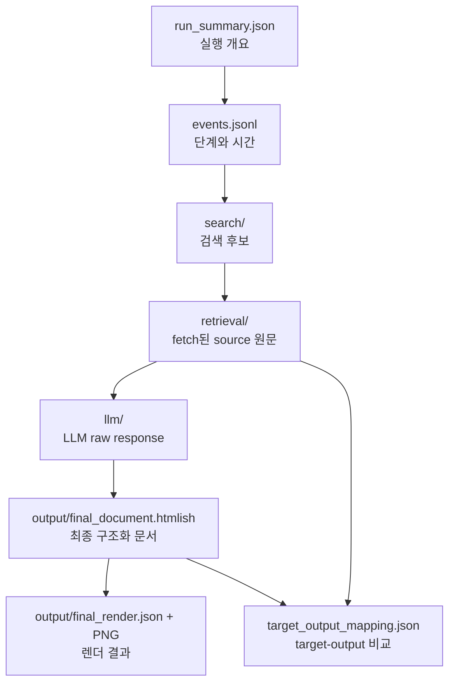

# 19. 로그설계안

## 목적

이 문서는 `llm-to-document`의 문서 생성 과정을 사용자가 직접 확인할 수 있도록 어떤 로그를 남겨야 하는지 정리한다.

핵심 원칙은 다음과 같다.

- 로그는 결과를 자동으로 판단하지 않는다.
- 로그는 사용자가 판단할 수 있도록 입력, 검색, 원문, LLM 응답, 최종 문서, 렌더 결과를 연결해서 보여준다.
- `warn`, `quality score`, `hallucination verdict` 같은 판정성 필드는 기본 로그 설계에서 제외한다.
- 대신 “무엇을 보고, 어떤 순서로, 얼마나 걸려서, 어떤 결과를 만들었는지”를 빠짐없이 남긴다.

문서 생성 결과가 좋은지 나쁜지는 문서 종류, 사용자 목적, 타깃 템플릿 성격에 따라 달라진다. 따라서 시스템이 일반 규칙으로 판정하려고 하면 오히려 잘못된 신호를 줄 가능성이 높다. 로그의 역할은 판정이 아니라 **검토 가능한 자료 제공**이다.

## 사용자가 확인해야 하는 질문

로그는 아래 질문에 답할 수 있어야 한다.

| 질문 | 필요한 로그 |
| --- | --- |
| 어떤 요청으로 실행됐나? | `run_summary.json` |
| 어떤 target/source 문서를 사용했나? | `run_summary.json`, `events.jsonl` |
| 문서 ID와 실제 문서 이름이 무엇인가? | 모든 문서 참조 payload |
| artifact는 새로 만들었나, 기존 것을 썼나? | `events.jsonl` |
| 각 단계는 얼마나 걸렸나? | `events.jsonl`의 `duration_ms` |
| AI가 어떤 검색어로 검색했나? | `search/first_stage*.json` |
| 검색 후보는 무엇이었나? | `search/first_stage*.json`, `search/first_stage.jsonl` |
| AI가 실제로 어떤 source page를 읽었나? | `retrieval/fetched_page_*.json`, `retrieval/fetched_page_*.html` |
| LLM 원본 응답은 무엇인가? | `llm/*.json` |
| 최종 `<document>`는 무엇인가? | `output/final_document.htmlish` |
| target block이 output block으로 어떻게 바뀌었나? | `output/target_output_mapping.json` |
| 실제 렌더 결과는 어떤가? | `output/final_render.json`, `output/rendered_page_*.png`, WebUI |

## 현재 방식과 이전 방식 비교

### 현재 `debug_*` 방식

현재 실행 결과는 대체로 아래처럼 저장된다.

```text
debug_20260428_214954/
  messages.md
  trace.jsonl
  final.json
```

장점:

- 현재 DB 기반 실행과 연결되어 있다.
- `messages.md` 하나에 사용자 입력, prompt, LLM 응답, tool call, trace가 모인다.
- `final.json`을 WebUI에서 바로 볼 수 있다.

한계:

- `messages.md`에 너무 많은 정보가 섞여 있어 원하는 정보를 찾기 어렵다.
- LLM raw response, 검색 결과, fetched source page, 최종 output document가 파일 단위로 분리되어 있지 않다.
- `trace.jsonl`에는 이벤트는 있지만 실행 단위 `run_id`, 단계별 소요 시간, 문서 이름 병기가 부족하다.
- `document_id=1`처럼 tool 내부 번호와 실제 DB `doc_id`가 헷갈릴 수 있다.
- 렌더 결과를 PNG로 바로 확인하기 어렵다.

### 이전 `output/.../trace/{run_id}` 방식

이전 방식에는 아래 구조가 있었다.

```text
output/integrate3_financial3_financial2/
  debug_finish_1.png
  debug_finish_2.png
  debug_finish_3.png
  debug_finish_4.png
  debug_write_input.json
  debug_write_input.txt
  debug_write_output.txt
  debug_write_reason.txt
  semantic_artifacts/
  trace/
    20260427T065758588063Z-7fb2e52b/
      analysis.json
      events.jsonl
      llm/
        tool_loop_response_1.json
        tool_loop_response_2.json
        tool_loop_response_3.json
        analysis_response.json
        final_document_response.json
      search/
        first_stage.jsonl
        first_stage_response_001.json
        first_stage_response_002.json
        first_stage_response_003.json
```

가져올 만한 점:

- 실행 단위별 `run_id` 폴더가 있어 추적이 쉽다.
- `events.jsonl`이 시간순 실행 흐름을 보기 좋게 담는다.
- `llm/` 폴더에 LLM raw response를 따로 보존한다.
- `search/` 폴더에 검색 과정을 따로 보존한다.
- `analysis.json`이 모델이 스스로 정리한 사용 근거와 작성 전략을 담는다.
- `semantic_artifacts/reference_visualization.html`로 source 문서 분석 상태를 시각적으로 볼 수 있다.
- `debug_finish_*.png`로 최종 렌더 결과를 바로 확인할 수 있다.

보완할 점:

- `analysis.json`은 이름만 보면 시스템 판정처럼 보일 수 있다. `generation_notes.json`처럼 모델의 자기 보고서임을 드러내는 이름이 좋다.
- `debug_write_reason.txt`는 tool call 목록만 있어 정보량이 부족하다.
- `document_id` 표기가 문자열 방식과 숫자 방식으로 섞일 경우 혼동 가능성이 있다.
- 최종 output, render, preview 이미지가 루트에 흩어져 있어 `output/` 하위로 묶는 편이 좋다.

## 권장 로그 패키지 구조

실행마다 하나의 `run_id` 폴더를 만든다.

```text
trace/{run_id}/
  run_summary.json
  events.jsonl
  messages.md

  llm/
    write_prompt.txt
    tool_loop_request_001.json
    tool_loop_response_001.json
    tool_loop_request_002.json
    tool_loop_response_002.json
    analysis_response.json
    final_document_response.json

  search/
    first_stage.jsonl
    first_stage_response_001.json
    first_stage_response_002.json

  retrieval/
    fetched_page_001.json
    fetched_page_001.html
    fetched_page_002.json
    fetched_page_002.html

  output/
    final_document.htmlish
    final_render.json
    rendered_page_001.png
    rendered_page_002.png
    rendered_page_003.png
    rendered_page_004.png
    target_output_mapping.json

  semantic_artifacts/
    {source_doc}/01_reference/
      reference_visualization.html
      canonical_pages.json
      parser_diagnostics.json
      semantic_overlay.json
      semantic_trace.json
      raw/
      layout_preview/
```

각 영역의 의미는 다음과 같다.

| 경로 | 의미 | 왜 확인해야 하나 |
| --- | --- | --- |
| `run_summary.json` | 실행 전체 인덱스 | 어떤 요청, 문서, 산출물인지 빠르게 확인 |
| `events.jsonl` | 시간순 이벤트 로그 | 어떤 단계가 어떤 순서로 실행됐고 얼마나 걸렸는지 확인 |
| `messages.md` | 사람이 읽는 통합 로그 | 전체 흐름을 텍스트로 빠르게 훑기 |
| `llm/` | LLM 원본 요청/응답 | 모델이 실제로 무엇을 받았고 무엇을 냈는지 확인 |
| `search/` | source 후보 검색 과정 | 어떤 검색어와 후보가 있었는지 확인 |
| `retrieval/` | 실제 fetch된 source page | 모델이 실제로 읽은 원문 확인 |
| `output/` | 최종 생성물과 렌더 결과 | 생성 문서와 화면 결과 확인 |
| `semantic_artifacts/` | OCR/semantic 분석 산출물 | source 문서가 어떻게 구조화됐는지 확인 |

## 로그 확인 흐름



이 흐름은 품질 판정 기준이 아니다. 사용자가 결과를 검토할 때 어떤 자료를 어떤 순서로 보면 좋은지 안내하는 검토 동선이다.

## 공통 이벤트 로그 설계

`events.jsonl`은 실행 흐름을 시간순으로 남기는 핵심 로그다. 한 줄에 하나의 JSON object를 쓴다.

기본 스키마:

```json
{
  "time": "2026-04-27 15:57",
  "ts": "2026-04-27T06:57:58.597548+00:00",
  "run_id": "20260427T065758588063Z-7fb2e52b",
  "component": "create_document",
  "event": "run_started",
  "duration_ms": null,
  "payload": {}
}
```

필드 의미:

| 필드 | 의미 | 왜 필요한가 |
| --- | --- | --- |
| `time` | 사람이 읽는 로컬 시간 | 로그를 눈으로 볼 때 편하다 |
| `ts` | ISO timestamp | 정렬, 계산, 자동 분석에 필요 |
| `run_id` | 실행 단위 ID | 여러 실행 결과를 섞이지 않게 구분 |
| `component` | 이벤트를 남긴 영역 | create/search/render 등 위치 파악 |
| `event` | 발생한 일 | 실행 흐름 파악 |
| `duration_ms` | 해당 단계 소요 시간 | 병목 구간 확인 |
| `payload` | 이벤트별 상세 정보 | 문서, query, 파일 경로, tool call 등 확인 |

`duration_ms`는 단계가 끝나는 이벤트에 기록한다. 시작 이벤트에는 `null`이어도 된다.

예시:

```json
{
  "time": "2026-04-27 16:03",
  "ts": "2026-04-27T07:03:17.100350+00:00",
  "run_id": "20260427T065758588063Z-7fb2e52b",
  "component": "create_document",
  "event": "render_completed",
  "duration_ms": 3507,
  "payload": {
    "page_count": 4,
    "output_path": "output/final_render.json"
  }
}
```

## 단계별 시간 측정 로그

문서 생성은 여러 하위 단계로 나뉜다. 각 단계의 시작과 종료를 남기면 사용자는 “어디서 오래 걸렸는지”를 바로 확인할 수 있다.

필수 시간 측정 단계:

| 단계 | 시작 이벤트 | 종료 이벤트 | 확인 이유 |
| --- | --- | --- | --- |
| 전체 실행 | `run_started` | `run_completed` | 전체 소요 시간 확인 |
| artifact 준비 | `artifact_prepare_started` | `artifact_prepare_completed` | OCR/Style/Semantic 캐시 사용 여부와 병목 확인 |
| 레이아웃 로드 | `layout_load_started` | `layout_load_completed` | target/source page와 block 구조 로드 확인 |
| LLM tool loop | `tool_loop_started` | `tool_loop_completed` | 도구 사용 기반 작성 단계 소요 시간 확인 |
| 검색 도구 | `search_started` | `search_completed` | 검색 지연, query expansion 지연 확인 |
| source fetch | `fetch_started` | `fetch_completed` | 실제 원문 조회 비용 확인 |
| 분석 요약 | `analysis_started` | `analysis_completed` | 모델의 자기 설명 생성 시간 확인 |
| 최종 문서 생성 | `final_document_started` | `final_document_completed` | 최종 LLM 응답 시간 확인 |
| 렌더 | `render_started` | `render_completed` | 이미지 처리/HTML overlay 시간 확인 |
| 산출물 저장 | `save_outputs_started` | `save_outputs_completed` | 로그/파일 저장 완료 확인 |

예시:

```json
{
  "component": "create_document",
  "event": "artifact_prepare_completed",
  "duration_ms": 1842,
  "payload": {
    "documents": [
      {
        "role": "target",
        "doc_id": 4,
        "display_name": "financial2.pdf",
        "page_count": 4,
        "artifacts": {
          "OCRArtifact": "loaded_from_db",
          "StyleArtifact": "loaded_from_db",
          "SemanticArtifact": "loaded_from_db"
        }
      },
      {
        "role": "source",
        "doc_id": 6,
        "display_name": "news1.pdf",
        "page_count": 2,
        "artifacts": {
          "OCRArtifact": "loaded_from_db",
          "StyleArtifact": "loaded_from_db",
          "SemanticArtifact": "loaded_from_db"
        }
      }
    ]
  }
}
```

이 로그는 “좋다/나쁘다”를 말하지 않는다. 사용자가 OCR이 새로 돌았는지, DB artifact를 썼는지, 어떤 문서가 오래 걸렸는지 확인하게 해준다.

## 문서 식별자 기록 규칙

모든 로그에서 문서를 언급할 때는 ID와 이름을 같이 쓴다.

기본 형식:

```json
{
  "doc_id": 6,
  "display_name": "news1.pdf"
}
```

source tool 내부에서 쓰는 `document_id`가 실제 DB ID가 아닐 수 있으므로, tool alias와 실제 문서를 분리한다.

예시:

```json
{
  "tool_document_id": 1,
  "actual_doc_id": 6,
  "display_name": "news1.pdf",
  "page_id": 2
}
```

확인 이유:

- LLM tool에는 source 문서 목록 안의 1번째 문서가 `document_id=1`로 보일 수 있다.
- DB에는 같은 문서가 `doc_id=6`일 수 있다.
- 로그에서 둘을 구분하지 않으면 사용자가 어떤 문서가 실제로 사용됐는지 잘못 해석할 수 있다.

## `run_summary.json`

`run_summary.json`은 실행 결과의 목차 역할을 한다. 사용자는 이 파일만 보고 전체 산출물 위치와 실행 조건을 파악할 수 있어야 한다.

예시:

```json
{
  "run_id": "20260427T065758588063Z-7fb2e52b",
  "chat_id": 1,
  "query": "트럼프 관련 기사로 문서 작성해줘",
  "started_at": "2026-04-28T21:49:54+09:00",
  "finished_at": "2026-04-28T22:03:00+09:00",
  "duration_ms": 786000,
  "target_doc": {
    "doc_id": 4,
    "display_name": "financial2.pdf",
    "page_count": 4
  },
  "source_docs": [
    {
      "doc_id": 6,
      "display_name": "news1.pdf",
      "page_count": 2
    }
  ],
  "paths": {
    "events": "events.jsonl",
    "messages": "messages.md",
    "final_document": "output/final_document.htmlish",
    "final_render": "output/final_render.json",
    "search": "search/first_stage.jsonl"
  }
}
```

의미:

- 실행 하나를 대표하는 인덱스다.
- 다른 로그 파일을 찾기 위한 출발점이다.
- target/source 문서 ID와 이름을 동시에 보여준다.
- 전체 소요 시간을 보여준다.

확인 이유:

- 사용자가 여러 번 실행했을 때 어떤 로그가 어떤 실행인지 구분하기 위해 필요하다.
- WebUI, CLI, 디버그 폴더 사이를 연결하는 기준점이 된다.

## `events.jsonl`

`events.jsonl`은 전체 실행의 타임라인이다.

예시:

```json
{"time":"2026-04-27 15:57","ts":"2026-04-27T06:57:58.597548+00:00","run_id":"20260427T065758588063Z-7fb2e52b","component":"create_document","event":"run_started","duration_ms":null,"payload":{"query":"삼성전자 관련 브리핑을 작성해줘","src_docs":[{"doc_id":5,"display_name":"financial3.pdf"}],"target_doc":{"doc_id":4,"display_name":"financial2.pdf"}}}
{"time":"2026-04-27 15:58","ts":"2026-04-27T06:58:08.851730+00:00","run_id":"20260427T065758588063Z-7fb2e52b","component":"create_document","event":"tool_requested","duration_ms":null,"payload":{"tool":"search_source_document","call_id":"call_06e36b250ca248ffa3930578","arguments":"{\"query\":\"삼성전자 기업분석 브리핑\"}"}}
{"time":"2026-04-27 16:03","ts":"2026-04-27T07:03:17.100350+00:00","run_id":"20260427T065758588063Z-7fb2e52b","component":"create_document","event":"render_completed","duration_ms":3507,"payload":{"page_count":4}}
```

의미:

- 실제 실행 순서를 그대로 보여준다.
- 각 단계의 입력과 결과 위치를 연결한다.
- `duration_ms`로 단계별 시간 확인이 가능하다.

확인 이유:

- 어느 단계에서 오래 걸렸는지 확인할 수 있다.
- 검색, fetch, final LLM, render가 어떤 순서로 일어났는지 확인할 수 있다.
- 실패 시 마지막 이벤트를 보고 멈춘 위치를 찾을 수 있다.

## `llm/` 로그

`llm/` 폴더는 LLM에 보낸 요청과 받은 원본 응답을 보존한다.

권장 파일:

```text
llm/
  write_prompt.txt
  tool_loop_request_001.json
  tool_loop_response_001.json
  tool_loop_request_002.json
  tool_loop_response_002.json
  analysis_response.json
  final_document_response.json
```

각 파일 의미:

| 파일 | 의미 | 확인 이유 |
| --- | --- | --- |
| `write_prompt.txt` | 모델에게 준 전체 작성 지시문 | target 구조와 작성 제약 확인 |
| `tool_loop_request_*.json` | tool loop 직전 LLM input | 모델이 어떤 context를 받았는지 확인 |
| `tool_loop_response_*.json` | tool call 또는 중간 응답 | 모델이 어떤 도구를 왜 호출했는지 확인 |
| `analysis_response.json` | 모델의 자기 설명 응답 | 모델이 어떤 근거를 사용했다고 보고했는지 확인 |
| `final_document_response.json` | 최종 `<document>` 응답 원본 | 최종 output이 어떻게 나왔는지 확인 |

주의:

- `analysis_response.json`은 시스템 판정이 아니다.
- 모델이 스스로 정리한 설명이므로 source 원문과 대조해야 한다.
- 그래도 사용자가 결과를 검토할 때 어떤 근거를 모델이 의식했는지 확인하는 데 유용하다.

## `search/` 로그

`search/` 폴더는 source 문서 후보 검색 과정을 보존한다.

권장 파일:

```text
search/
  first_stage.jsonl
  first_stage_response_001.json
  first_stage_response_002.json
```

`first_stage.jsonl`은 검색 과정의 이벤트를 누적한다.

예시:

```json
{
  "component": "search.first_stage",
  "event": "query_preprocessed",
  "payload": {
    "query": "삼성전자 기업분석 브리핑",
    "normalized_query": "삼성전자 기업분석 브리핑",
    "query_tokens": ["삼성전자", "기업분석", "브리핑"],
    "semantic_queries": ["삼성전자 기업분석 브리핑"],
    "lexical_queries": ["삼성전자 기업분석 브리핑"]
  }
}
```

검색 후보 파일 예시:

```json
{
  "query": "삼성전자 기업분석 브리핑",
  "expanded": {
    "entities": ["삼성전자"],
    "semantic_queries": ["삼성전자 기업 분석 브리핑 요약"],
    "lexical_queries": ["삼성전자 기업분석 브리핑 재무 경영 분석"]
  },
  "candidates": [
    {
      "rank": 1,
      "doc_id": 5,
      "display_name": "financial3.pdf",
      "page_id": 1,
      "block_id": "paddle-financial3-00-9",
      "channels": ["bm25"],
      "matched_terms": ["삼성전자"],
      "preview": "삼성전자"
    }
  ]
}
```

의미:

- 모델이 요청한 검색어가 무엇인지 보여준다.
- query expansion 결과를 보여준다.
- 어떤 후보 block이 어떤 채널로 검색됐는지 보여준다.

확인 이유:

- 최종 문서가 엉뚱한 내용으로 작성됐을 때 검색 단계에서 잘못된 후보를 찾았는지 확인할 수 있다.
- source page fetch가 어떤 후보를 바탕으로 결정됐는지 추적할 수 있다.

## `retrieval/` 로그

`retrieval/` 폴더는 실제로 모델에게 제공된 source page 원문을 저장한다.

권장 파일:

```text
retrieval/
  fetched_page_001.json
  fetched_page_001.html
  fetched_page_002.json
  fetched_page_002.html
```

예시:

```json
{
  "tool_call": {
    "tool": "fetch_source_document",
    "call_id": "call_043ba0ce819d42ae86d2dd1e",
    "arguments": {
      "tool_document_id": 1,
      "page_id": 2
    }
  },
  "resolved_document": {
    "actual_doc_id": 6,
    "display_name": "news1.pdf"
  },
  "page": {
    "page_id": 2,
    "block_count": 44,
    "html_path": "retrieval/fetched_page_001.html"
  }
}
```

의미:

- LLM이 실제로 읽은 source page를 보존한다.
- tool 내부 문서 번호와 실제 DB 문서 ID를 연결한다.

확인 이유:

- 최종 결과가 source에 근거했는지 사용자가 직접 대조할 수 있다.
- 검색 후보는 많더라도 실제로 모델이 읽은 것은 fetched page뿐이므로, 이 로그가 가장 중요한 근거 원문이다.

## `generation_notes.json`

이전 방식의 `analysis.json`은 유용하지만 이름을 바꿔 의미를 명확히 하는 것이 좋다.

권장 이름:

```text
generation_notes.json
```

권장 스키마:

```json
{
  "query": "삼성전자 관련 브리핑을 작성해줘",
  "user_intent": "타깃 문서의 레이아웃을 유지하면서 삼성전자 기업분석 브리핑 작성",
  "source_documents": [
    {
      "doc_id": 5,
      "display_name": "financial3.pdf",
      "used": true,
      "reason": "삼성전자 목표주가, 현재가, 재무 데이터, 분석 논평을 제공함"
    }
  ],
  "evidence": [
    {
      "doc_id": 5,
      "display_name": "financial3.pdf",
      "page_id": 1,
      "block_id": "block-3",
      "used_for": "매수/목표주가/현재주가 정보 추출"
    }
  ],
  "writing_strategy": [
    "타깃 문서의 div bbox 및 HTML 구조를 유지하고 내부 텍스트와 표를 교체함"
  ],
  "uncertainties": [
    "소스 문서에 BPS 항목이 명시되지 않아 해당 항목은 비워둠"
  ]
}
```

의미:

- 모델이 어떤 의도로 작성했는지 설명한다.
- 모델이 어떤 source block을 사용했다고 보고했는지 보여준다.
- 불확실하거나 비워둔 부분을 모델 관점에서 기록한다.

확인 이유:

- 사용자가 최종 문서와 source 원문을 대조할 때 출발점으로 쓸 수 있다.
- 단, 이 파일은 모델의 자기 보고서이지 검증 결과가 아니다.

## `output/` 로그

`output/` 폴더는 최종 산출물을 모은다.

권장 파일:

```text
output/
  final_document.htmlish
  final_render.json
  rendered_page_001.png
  rendered_page_002.png
  target_output_mapping.json
```

### `final_document.htmlish`

LLM이 만든 최종 `<document id="output">...</document>`만 저장한다.

확인 이유:

- `messages.md` 안에서 최종 출력을 찾지 않아도 된다.
- 최종 문서 구조와 block id를 직접 확인할 수 있다.

### `final_render.json`

WebUI가 사용하는 최종 렌더 JSON이다.

확인 이유:

- 실제 화면 렌더에 사용된 block, bbox, font, html을 확인할 수 있다.
- LLM output이 렌더 과정에서 어떻게 바뀌었는지 확인할 수 있다.

### `rendered_page_*.png`

최종 렌더 미리보기 이미지다.

확인 이유:

- WebUI를 열지 않고도 결과를 빠르게 확인할 수 있다.
- 텍스트 겹침, 빈 페이지, 어색한 배치 등을 눈으로 확인할 수 있다.

### `target_output_mapping.json`

target block과 output block을 연결한다.

예시:

```json
[
  {
    "target_block_id": "target-page-1-block-18",
    "output_block_id": "output-page-1-block-18",
    "bbox": [329, 268, 931, 517],
    "target_preview": "KMW의 12개월 목표주가를...",
    "output_preview": "도널드 트럼프 미국 대통령이..."
  }
]
```

의미:

- target의 어느 영역이 output의 어떤 내용으로 바뀌었는지 보여준다.

확인 이유:

- 사용자가 문서 레이아웃 보존 여부를 직접 확인할 수 있다.
- 특정 block이 이상할 때 원래 target block과 비교할 수 있다.

## `semantic_artifacts/`

source 문서의 OCR/semantic 분석 결과를 보존한다.

중요 파일:

```text
semantic_artifacts/{doc}/01_reference/
  reference_visualization.html
  canonical_pages.json
  parser_diagnostics.json
  semantic_overlay.json
  semantic_trace.json
  raw/paddle/*.json
  raw/paddle/*.md
  layout_preview/*.png
```

의미:

- source 문서가 어떤 OCR block으로 나뉘었는지 보여준다.
- semantic role이 어떻게 붙었는지 보여준다.
- 원본 OCR markdown과 layout preview를 제공한다.

확인 이유:

- source 검색 결과가 이상할 때 OCR 자체가 잘못됐는지 확인할 수 있다.
- `reference_visualization.html`을 열면 문서 분석 상태를 시각적으로 확인할 수 있다.

## 사용자가 로그를 보는 권장 순서

1. `run_summary.json`
   - 실행 ID, query, target/source 문서 확인
   - 문서 ID와 이름 확인

2. `events.jsonl`
   - 단계별 실행 순서 확인
   - 각 단계별 `duration_ms` 확인
   - 오래 걸린 단계 확인

3. `search/first_stage*.json`
   - 어떤 검색어와 query expansion이 사용됐는지 확인
   - 어떤 후보 block이 나왔는지 확인

4. `retrieval/fetched_page_*.html`
   - LLM이 실제로 읽은 원문 확인

5. `llm/final_document_response.json`
   - 모델의 최종 raw response 확인

6. `output/final_document.htmlish`
   - 최종 문서 구조 확인

7. `output/target_output_mapping.json`
   - target block과 output block 비교

8. `output/rendered_page_*.png` 또는 WebUI
   - 실제 화면 결과 확인

이 순서는 사용자가 직접 판단하기 위한 검토 동선이다. 시스템은 이 과정에서 “잘됨/못됨”을 판정하지 않는다.

## 로그 설계에서 제외할 것

아래 항목은 기본 로그 설계에서 제외한다.

- `warn`
- `quality_score`
- `hallucination_score`
- `supported/unsupported` 자동 판정
- 도메인별 정답 규칙
- 문서 유형별 하드코딩 검증

제외 이유:

- 여러 문서 유형을 처리해야 하므로 일반화가 어렵다.
- 시스템이 잘못된 기준으로 품질을 판정할 수 있다.
- 로그의 목적은 검토 자료 제공이지 자동 평가가 아니다.

대신 남길 것:

- 입력
- 사용 문서
- 검색 후보
- fetch 원문
- LLM 원본 응답
- 최종 output
- target-output mapping
- 렌더 결과
- 단계별 소요 시간

## 정리

좋은 로그는 결과를 대신 판단하지 않는다. 좋은 로그는 사용자가 판단할 수 있도록 필요한 자료를 연결해준다.

따라서 `llm-to-document`의 로그 설계는 다음 원칙으로 정리한다.

```text
판정하지 않는다.
흩어진 원본을 보존한다.
서로 비교할 수 있게 연결한다.
각 단계가 얼마나 걸렸는지 남긴다.
문서 ID와 문서 이름을 항상 같이 남긴다.
```

이 구조를 따르면 금융 문서, 뉴스 문서, 블로그 문서, 의료 문서처럼 서로 다른 형태의 문서를 처리하더라도 로그의 역할이 흔들리지 않는다. 사용자는 같은 방식으로 실행 흐름, 검색 근거, 원문, 최종 문서, 렌더 결과를 직접 확인할 수 있다.

