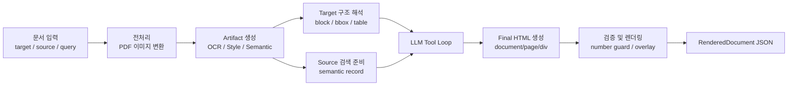
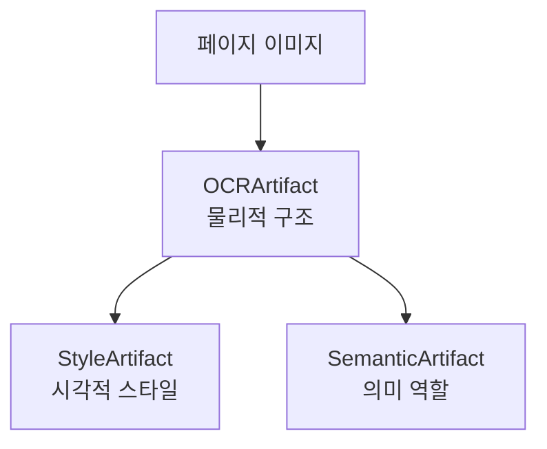
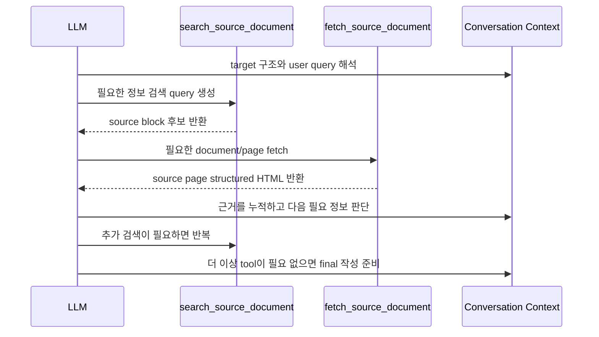

# llm-to-document 핵심 프로세스 설명 문서

## 0. 간결 요약

이 프로젝트는 사용자의 요청에 맞춰 **source 문서의 내용**을 **target 문서의 구조와 스타일**에 맞게 재작성하는 문서 생성 시스템이다.

일반적인 LLM 텍스트 생성과 다르게, 이 시스템은 문서를 페이지와 블록 단위로 분석하고, target 문서의 레이아웃을 템플릿처럼 사용한다. source 문서는 처음부터 LLM prompt에 전부 넣지 않고, LLM이 필요한 근거를 `search_source_document`와 `fetch_source_document` 도구로 찾아가며 사용한다. 최종적으로 LLM은 렌더링 가능한 HTML 형태의 문서를 만들고, 시스템은 이 내용을 target 문서의 원래 위치와 스타일 위에 다시 그려 `RenderedDocument` JSON으로 저장한다.

핵심 흐름은 다음과 같다.

```text
target 문서 + source 문서 + user query
→ 문서 전처리
→ OCR/Style/Semantic Artifact 생성
→ target 구조를 템플릿으로 해석
→ source 문서 검색 및 page fetch
→ LLM tool loop
→ final HTML 생성
→ 검증 및 렌더링
→ rendered document JSON 저장
```

---

## 1. 프로젝트 한 줄 요약

**source 문서에서 근거를 찾아 target 문서의 레이아웃, 블록 구조, 표 형식, 시각적 스타일에 맞춰 새 문서를 생성하는 근거 기반 문서 재작성 파이프라인이다.**

이 프로젝트의 핵심은 LLM에게 단순히 "보고서 써줘"라고 요청하는 것이 아니다. 문서를 다음 세 가지 관점으로 나누어 처리한다.

| 관점 | 역할 |
|---|---|
| target 문서 | 어떤 위치에, 어떤 형식으로, 어느 정도 길이로 쓸지 알려주는 템플릿 |
| source 문서 | 최종 문서에 들어갈 실제 정보와 수치의 근거 |
| user query | 어떤 주제와 목적의 문서를 만들지 알려주는 생성 의도 |

즉, target은 **형식의 기준**이고 source는 **내용의 근거**다. LLM은 이 둘을 연결하는 역할을 한다.

---

## 2. 전체 프로세스 개요

### 전체 파이프라인



### 주요 입력

| 입력 | 설명 |
|---|---|
| target 문서 | 최종 결과가 따라야 하는 레이아웃과 스타일의 기준 문서 |
| source 문서 | 최종 결과에 들어갈 내용의 근거 문서 |
| user query | 사용자가 원하는 문서 주제와 작성 의도 |

### 주요 중간 산출물

| 산출물 | 의미 |
|---|---|
| OCRArtifact | 문서의 페이지, 블록, 텍스트, 표, 이미지, bbox 구조 |
| StyleArtifact | target 블록별 글꼴, 색상, 크기, 줄 간격 |
| SemanticArtifact | source 블록별 의미 역할과 section 정보 |

### 주요 출력

| 출력 | 설명 |
|---|---|
| final HTML | LLM이 생성한 `<document id="output">...</document>` 형태의 구조화 문서 |
| rendered document JSON | target 배경 이미지 위에 새 block HTML을 overlay한 최종 렌더링 결과 |

---

## 3. 1단계: 문서 입력과 전처리

### 목적

PDF나 이미지 문서를 LLM이 바로 다루는 것이 아니라, 이후 OCR과 렌더링이 가능한 **페이지 이미지 단위의 입력**으로 바꾼다.

### 입력

- 사용자가 업로드한 target 문서
- 사용자가 업로드한 source 문서
- 문서 형식: 주로 PDF 또는 이미지

### 처리 과정

PDF 문서는 페이지별 이미지로 변환된다. 이 프로젝트에서는 PDF 내부의 텍스트 레이어나 CSS를 직접 신뢰하기보다, 문서를 이미지로 렌더링한 뒤 OCR과 시각 분석을 수행한다.

이 방식은 비용이 있지만 장점이 있다.

- PDF 내부 구조가 복잡하거나 깨져 있어도 시각적으로 보이는 결과를 기준으로 분석할 수 있다.
- bbox, 표, 이미지, 텍스트 위치를 페이지 이미지 기준으로 통일해서 다룰 수 있다.
- 최종 렌더링에서도 원래 target 페이지 이미지를 배경으로 사용할 수 있다.

### 출력

- 문서별 페이지 이미지
- 페이지 순서 정보
- 이후 Artifact 생성에 사용할 이미지 입력

### 다음 단계에서의 사용

페이지 이미지는 OCRArtifact, StyleArtifact, SemanticArtifact 생성의 기반이 된다. 특히 OCRArtifact는 이 이미지에서 block 구조를 추출하고, StyleArtifact는 target 이미지에서 글자 스타일을 추정한다.

---

## 4. 2단계: Artifact 생성

### 목적

문서를 LLM이 사용하기 쉬운 구조화 데이터로 바꾼다. 이 단계는 문서 생성의 기반이 되는 가장 중요한 준비 단계다.

Artifact는 크게 세 가지다.



### 4.1 OCRArtifact

#### 목적

문서를 page와 block 단위로 나누고, 각 block의 위치와 내용을 저장한다.

#### 입력

- 페이지 이미지

#### 처리 과정

OCR 파이프라인은 각 페이지에서 텍스트, 표, 차트, 이미지 같은 block을 감지한다. 각 block에는 다음 정보가 포함된다.

| 정보 | 설명 |
|---|---|
| page | 몇 번째 페이지의 block인지 |
| block index | 페이지 안에서 몇 번째 block인지 |
| label | text, table, image, chart 등 OCR이 판단한 유형 |
| content | OCR로 추출한 텍스트 또는 table HTML |
| bbox | 페이지 이미지 안에서 block이 차지하는 좌표 |

#### 출력

OCRArtifact는 문서를 다음처럼 구조화한다.

```text
Document
  Page 1
    Block 1: title, bbox, text
    Block 2: table, bbox, table html
    Block 3: paragraph, bbox, text
  Page 2
    ...
```

#### 다음 단계에서의 사용

- target 문서의 structured HTML 생성
- source 문서의 fetch 결과 생성
- source 검색 record 생성
- final HTML을 target block 위치에 매핑
- 렌더링 시 block bbox 기준으로 overlay

OCRArtifact는 세 Artifact 중 가장 기본이 되는 구조다.

### 4.2 StyleArtifact

#### 목적

target 문서의 시각적 스타일을 추정해서, 새로 생성한 내용을 원래 문서처럼 보이게 렌더링한다.

#### 입력

- target 페이지 이미지
- target OCRArtifact의 block bbox

#### 처리 과정

StyleArtifact는 block 영역을 이미지에서 잘라낸 뒤, 글자 스타일을 추정한다.

주요 분석 항목은 다음과 같다.

| 항목 | 설명 |
|---|---|
| line_count | block 내부 줄 수 |
| line_height | block 높이와 줄 수를 기반으로 추정한 줄 높이 |
| font_family | 후보 font 중 실제 글자 이미지와 가장 유사한 font |
| font_size | 글자 이미지 크기를 기반으로 추정한 font size |
| color | 글자 픽셀의 대표 색상 |

중요한 점은 이 시스템이 PDF의 font metadata를 그대로 읽는 방식이 아니라는 것이다. 실제 문서 이미지에서 글자를 잘라 후보 font와 비교하고, 가장 비슷한 font를 선택한다.

#### 출력

각 target block에 대해 다음 형태의 스타일 정보가 만들어진다.

```text
BlockStyle
  line_count
  line_height
  font_family
  font_size
  color
```

#### 다음 단계에서의 사용

최종 렌더링 단계에서 LLM이 생성한 새 HTML 내용을 target block 위치에 그릴 때 사용된다.

즉, StyleArtifact는 **내용 생성**보다는 **결과물을 원래 target 문서처럼 보이게 만드는 렌더링 품질**에 직접 관여한다.

### 4.3 SemanticArtifact

#### 목적

OCR block이 문서 안에서 어떤 의미 역할을 하는지 분석한다.

OCRArtifact가 "이 block은 텍스트다"라고 말한다면, SemanticArtifact는 "이 block은 보고서 제목이다", "이 block은 투자 의견 요약이다", "이 block은 재무 테이블이다"처럼 더 높은 수준의 역할을 붙인다.

#### 입력

- OCRArtifact의 page/block/text/bbox 정보

#### 처리 과정

SemanticArtifact는 OCR block을 먼저 표준화된 `CanonicalBlock`으로 바꾼다. 이후 block의 텍스트, 위치, 주변 block, 페이지 유형을 함께 보고 의미 역할을 분류한다.

예시 역할은 다음과 같다.

| 역할 | 의미 |
|---|---|
| report_title | 보고서 제목 |
| investment_opinion_box | 투자의견/목표주가 요약 영역 |
| key_data_box | Key Data 영역 |
| consensus_box | Consensus Data 영역 |
| financial_table_block | 재무 테이블 |
| thesis_heading | 투자 포인트 제목 |
| supporting_argument | 본문 근거 문단 |
| analyst_info | 애널리스트 정보 |
| disclaimer_block | 고지사항 |

#### 출력

SemanticArtifact는 block별로 다음 정보를 포함한다.

```text
generic_role
domain_role
role_confidence
section_id
section_purpose
used_for_generation
generated_role_name
generated_role_description
```

#### 다음 단계에서의 사용

source 문서를 검색할 때 OCR 텍스트만 사용하지 않고, semantic role도 같이 사용한다. 예를 들어 사용자가 "재무 전망을 반영해줘"라고 했을 때, 원문에 정확히 "재무 전망"이라는 단어가 없더라도 `financial_table_block`이나 `financial_forecast_table` 같은 의미 정보가 검색 품질을 높인다.

---

## 5. 3단계: Target 문서를 템플릿으로 사용

### 목적

target 문서를 내용의 근거가 아니라 **최종 문서의 형식 기준**으로 사용한다.

### 입력

- target OCRArtifact
- target StyleArtifact
- user query

### 처리 과정

target 문서는 LLM에게 structured HTML 형태로 전달된다. 이 HTML에는 page와 div 구조가 있고, 각 div는 target 문서의 block에 대응된다.

각 block에는 다음 정보가 들어간다.

| 정보 | 역할 |
|---|---|
| block id | 최종 output block과 매핑하기 위한 식별자 |
| data-bbox | 페이지 안에서 block의 위치와 크기 |
| block content | target의 기존 내용. 단, 내용 근거가 아니라 형식 참고용 |
| table structure | 표가 있는 경우 행/열 구조 참고 |

LLM은 target의 기존 내용을 사실로 믿으면 안 된다. target 내용은 "어떤 길이와 흐름으로 쓸지"를 알려주는 참고자료다.

### 출력

- LLM prompt에 포함되는 target structured HTML
- 최종 output이 따라야 할 block id와 구조

### 다음 단계에서의 사용

LLM은 target 구조를 보고 다음을 판단한다.

- 어떤 block이 제목인지
- 어떤 block이 요약인지
- 어떤 block이 본문 근거인지
- 어떤 block이 표인지
- 각 block에 어느 정도 길이와 형식의 내용이 들어가야 하는지

핵심은 다음과 같다.

```text
target = 어디에, 어떤 모양으로 쓸지 알려주는 문서
source = 무엇을 쓸지 알려주는 문서
```

---

## 6. 4단계: Source 문서 검색

### 목적

source 문서를 LLM prompt에 처음부터 전부 넣지 않고, 필요한 근거만 검색해서 가져온다.

### 입력

- source OCRArtifact
- source SemanticArtifact
- LLM이 생성한 검색 query
- user query
- target 문서 구조에서 유추한 필요한 정보

### 처리 과정

LLM은 문서 작성 중 필요한 정보가 있으면 `search_source_document`를 호출한다. 이 도구는 단순 문자열 검색이 아니라 여러 검색 신호를 결합한다.

검색 흐름은 `LLM 검색 질문 → query 전처리/확장 → Semantic Search, BM25, Entity Match 실행 → candidate merge/ranking → source block 후보 반환` 순서로 진행된다.

### Semantic Search

Semantic Search는 query와 의미적으로 가까운 source block을 찾는다.

예를 들어 query가 "향후 실적 전망은 어떤가?"라면, source에 "2026년 매출액과 영업이익은..."처럼 표현되어 있어도 의미적으로 관련된 block을 찾을 수 있다.

이 검색에는 source block의 원문뿐 아니라 SemanticArtifact의 역할 정보도 사용된다.

### BM25

BM25는 키워드 기반 검색이다.

정확한 단어, 수치, 기업명, 항목명이 중요할 때 유용하다.

예를 들어 다음과 같은 검색에는 BM25가 강하다.

- 삼성전자
- KMW
- 목표주가
- 영업이익
- 2026F
- CAPEX

### Entity Match

Entity Match는 기업명, 숫자, 코드, 단위처럼 중요한 entity가 source block에 포함되어 있는지 보조적으로 확인한다.

BM25와 일부 역할이 겹치지만, entity가 있는 후보를 보강하거나 tie-breaker로 활용할 수 있다.

### 출력

검색 결과는 최종 근거가 아니라 **후보 block 목록**이다.

후보에는 보통 다음 정보가 포함된다.

- document id
- page id
- block id
- block text preview
- 검색 점수
- 어떤 검색 신호로 매칭됐는지

### 다음 단계에서의 사용

LLM은 검색 후보를 보고 실제로 어떤 page를 열어볼지 판단한다. 이후 `fetch_source_document`를 호출해서 source page 전체 structured HTML을 가져온다.

---

## 7. 5단계: LLM Tool Loop

### 목적

LLM이 target 구조를 기준으로 문서에 필요한 정보를 스스로 판단하고, source 문서를 검색/fetch하면서 최종 문서 내용을 구성한다.

### 입력

LLM이 처음 받는 입력은 크게 세 가지다.

| 입력 | 설명 |
|---|---|
| user query | 사용자가 원하는 문서 작성 의도 |
| target structured HTML | target 문서의 page/block 구조 |
| tool schema | `search_source_document`, `fetch_source_document` 도구 설명 |

source 문서 전체 내용은 처음 prompt에 직접 들어가지 않는다.

### 처리 과정

LLM tool loop는 다음처럼 반복된다.



중요한 점은 이 구조가 "query 한 문장에 맞는 block 하나를 찾는 검색 시스템"이 아니라는 것이다.

LLM은 target 문서의 여러 block을 보고 다음을 판단한다.

- 제목에는 어떤 회사/주제가 들어가야 하는가?
- 요약 박스에는 어떤 핵심 수치가 필요한가?
- 본문 근거 문단에는 어떤 투자 포인트가 필요한가?
- 표에는 어떤 row/column 값이 들어가야 하는가?
- source 문서의 어느 page를 확인해야 하는가?

### 출력

tool loop 자체의 출력은 누적된 대화 context다. 이 context에는 다음이 포함된다.

- LLM의 tool call
- 검색 결과
- fetch된 source page HTML
- table retrieval preflight context
- LLM이 최종 작성에 사용할 evidence

### 다음 단계에서의 사용

tool loop가 끝나면 같은 context를 기반으로 두 가지 요청이 이어진다.

1. 근거 분석 JSON 생성
2. 최종 HTML 문서 생성

---

## 8. 6단계: 표 데이터 보강

### 목적

표는 일반 문단보다 항목과 수치의 정확한 매칭이 중요하다. 그래서 target 문서에 표가 있으면, LLM tool loop와 별도로 table retrieval preflight가 먼저 동작한다.

### 입력

- target OCRArtifact의 table block
- source OCRArtifact
- source 검색 도구
- user query

### 처리 과정

table retrieval preflight는 target table에서 다음 정보를 추출한다.

| 정보 | 설명 |
|---|---|
| title hint | 표 제목 또는 주변 제목 |
| row labels | 표의 행 항목 |
| column labels | 표의 열 항목 |
| query terms | 검색에 사용할 주요 항목 |

이후 표별로 primary query를 만들고 source 문서에서 후보 page를 검색한다. 후보 page를 확인한 뒤 target table의 row label이 source page에 얼마나 존재하는지 coverage를 계산한다.

coverage 상태는 크게 세 가지로 볼 수 있다.

| 상태 | 의미 |
|---|---|
| found | 필요한 row가 충분히 매칭됨 |
| partial | 일부 row만 매칭됨 |
| missing | 매칭되는 row가 거의 없음 |

부족한 row가 있으면 해당 row label을 중심으로 fallback query를 추가 실행한다.

### 출력

- target table inventory
- table별 coverage
- prefetch된 source page
- LLM에게 추가로 제공되는 table retrieval context

### 다음 단계에서의 사용

LLM은 final document를 작성할 때 table retrieval context를 참고한다. 이 context에는 "어떤 target table의 어떤 row가 source의 어떤 page에서 확인됐는지"가 정리되어 있다.

핵심은 다음이다.

```text
문단 작성 = 의미 흐름 중심
표 작성 = row/column 항목 매칭 중심
```

---

## 9. 7단계: 최종 문서 생성

### 목적

LLM이 tool loop에서 모은 근거를 바탕으로, 렌더링 가능한 최종 HTML 문서를 생성한다.

### 입력

- user query
- target structured HTML
- tool loop 결과
- fetch된 source page
- table retrieval context
- generation notes 생성을 위한 evidence context

### 처리 과정

tool 사용이 끝나면 시스템은 LLM에게 최종 문서 생성을 요청한다. 이때 출력 형식은 엄격하게 제한된다.

최종 출력은 반드시 다음 형태여야 한다.

```html
<document id="output">
  <page id="output-page-1">
    <div id="output-page-1-block-1">...</div>
    <div id="output-page-1-block-2">...</div>
  </page>
</document>
```

각 div id는 target 문서의 원래 block 위치와 연결된다.

예를 들어:

```text
output-page-1-block-6
```

은 target 문서 1페이지의 6번째 block 위치에 새 내용을 넣겠다는 뜻이다.

### 출력

- `final_document_response.html`
- `<document id="output">...</document>` 구조
- page/block id 기반의 렌더링 대상 HTML

### 다음 단계에서의 사용

시스템은 final HTML을 파싱해서 block별 HTML을 추출한다. 이후 target OCRArtifact의 bbox와 StyleArtifact의 스타일을 이용해 실제 렌더링 결과를 만든다.

---

## 10. 8단계: 검증과 렌더링

### 목적

LLM이 만든 HTML을 target 문서의 실제 위치와 스타일에 맞게 최종 결과물로 렌더링한다.

### 입력

- final HTML
- target OCRArtifact
- target StyleArtifact
- target 페이지 이미지
- source evidence text

### 처리 과정

먼저 final HTML에서 `<document>` 블록을 추출한다. 만약 LLM이 실수로 `target-page-*` id를 사용하면 `output-page-*`로 정규화한다.

그다음 각 div id를 기준으로 target block 위치에 매핑한다.

```text
output-page-2-block-3
→ target page 2의 3번째 block bbox
```

렌더링은 다음 방식으로 진행된다.

1. target 페이지 이미지를 배경으로 사용한다.
2. 새 내용이 들어갈 block bbox 영역을 지운다.
3. 해당 bbox 위에 final HTML 내용을 overlay한다.
4. StyleArtifact에서 추정한 font, size, color, line height를 적용한다.
5. 페이지별 렌더링 결과를 묶어 RenderedDocument JSON으로 저장한다.

### Number Guard

number guard는 source 근거에 없는 숫자를 final document에 넣는 것을 막기 위한 검증 단계다.

기본 의도는 다음과 같다.

```text
source evidence에서 숫자 추출
→ final HTML의 숫자 추출
→ source에 없는 숫자면 차단 또는 uncertainty 기록
```

다만 실제 로그 분석에서 `checked_item_count=0`인 사례가 있었다. 따라서 현재 발표에서는 이 기능을 "설계되어 있는 검증 장치"로 설명하되, 현재 구현/실행에서는 최종 숫자 검증이 충분히 작동하지 않은 한계가 있다고 말하는 것이 정확하다.

### 출력

- `final_render.json`
- background image data
- overlay block list
- block별 bbox, font, color, line height, html

### 다음 단계에서의 사용

최종 render JSON은 chat 결과로 저장되고, 사용자는 이 결과를 통해 생성된 문서를 확인할 수 있다.

---

## 11. 실행 로그 기반 사례

실행 로그는 위의 프로세스가 실제로 어떻게 동작했는지 보여주는 근거다. 발표에서는 로그를 전부 보여주기보다, 핵심 단계가 실제로 발생했다는 증거로 사용하는 것이 좋다.

### chat_15: KMW 보고서 생성 사례

chat_15는 비교적 단순한 흐름이다.

| 항목 | 내용 |
|---|---|
| user query | KMW 기업 보고서 작성 요청 |
| target | `financial1.pdf` |
| source | `financial2.pdf` |
| 전체 시간 | 약 8분 17초 |
| LLM tool call | 총 4회 |
| search | 1회 |
| fetch | source page 1, 2, 3 |
| render | 3페이지 |

이 사례의 의미는 다음과 같다.

- source 문서와 user query가 비교적 잘 맞았다.
- 한 번의 검색 후 source 주요 page를 fetch해서 문서 작성이 가능했다.
- table retrieval 전용 흐름은 뚜렷하게 보이지 않았다.
- number guard는 실행됐지만 실제 검사 수는 0이었다.

발표에서는 chat_15를 "기본 tool loop가 단순하게 동작한 사례"로 설명하면 좋다.

### chat_16: 삼성전자 보고서 생성 사례

chat_16은 더 복잡한 흐름이다.

| 항목 | 내용 |
|---|---|
| user query | 삼성전자 리포트 작성 요청 |
| target | `financial2.pdf` |
| source | `financial3.pdf` |
| 전체 시간 | 약 15분 23초 |
| target table | 9개 |
| search 관련 이벤트 | 23회 |
| LLM tool call | 총 8회 |
| LLM search | 6회 |
| LLM fetch | 2회 |
| render | 4페이지 |

chat_16에서는 table retrieval preflight가 중요하게 작동했다.

| table coverage | 개수 |
|---|---:|
| found | 4 |
| partial | 4 |
| missing | 1 |

이 사례의 의미는 다음과 같다.

- target 문서에 표가 많아 table retrieval이 많이 동작했다.
- source page prefetch와 row coverage 분석이 수행됐다.
- 일부 표는 source에서 충분한 row를 찾지 못했다.
- number guard는 실행됐지만 실제 검사 수는 0이었다.

발표에서는 chat_16을 "복잡한 문서에서 table retrieval과 source 검색의 한계가 드러난 사례"로 설명하면 좋다.

### 두 사례 비교

| 비교 항목 | chat_15 | chat_16 |
|---|---|---|
| 생성 난이도 | 낮음 | 높음 |
| source 검색 | 단순 | 반복적 |
| table retrieval | 거의 없음 | 핵심적으로 동작 |
| fetch page | 1, 2, 3 page | 6, 12 page 중심 + table prefetch |
| 결과 페이지 | 3 pages | 4 pages |
| 주요 한계 | number guard 미검증 | table coverage 부족, number guard 미검증 |

---

## 12. 프로젝트의 핵심 장점과 한계

### 핵심 장점

#### 1. source 전체를 prompt에 넣지 않는다

source 문서를 전부 LLM prompt에 넣으면 context가 커지고, 비용이 증가하며, LLM이 어떤 근거를 실제로 사용했는지 추적하기 어렵다.

이 프로젝트는 source를 tool로 접근하게 만들어 필요한 정보만 검색하고 가져오도록 한다.

#### 2. target 문서의 레이아웃과 스타일을 유지한다

일반 텍스트 생성은 문서의 위치, 표, 시각적 스타일을 보존하지 못한다.

이 프로젝트는 target OCRArtifact와 StyleArtifact를 사용해 block 위치와 스타일을 유지하면서 내용을 교체한다.

#### 3. source 근거 기반 생성을 시도한다

LLM이 임의로 내용을 지어내지 않도록 source 검색과 fetch를 거쳐 근거를 모은 뒤 작성하게 한다.

#### 4. 실행 과정을 로그로 추적할 수 있다

debug run에는 다음 정보가 남는다.

- 실행 시간
- artifact 생성 여부
- search query
- 검색 후보
- fetch된 source page
- final document
- render 결과
- table coverage
- number guard 결과

따라서 단순히 결과만 보는 것이 아니라, 왜 그런 결과가 나왔는지 분석할 수 있다.

### 핵심 한계

#### 1. block별 content planning이 완전히 명시적이지 않다

현재 LLM은 target 구조를 보고 스스로 필요한 정보를 검색하고 작성한다. 하지만 "이 target block에는 source의 어떤 block을 쓴다"는 계획이 사전에 명시적으로 고정되는 구조는 아니다.

따라서 결과 분석이나 오류 수정 시 block 단위 추적이 어려울 수 있다.

#### 2. 표 데이터 매칭은 아직 보완이 필요하다

table retrieval preflight가 있지만, chat_16처럼 일부 table은 partial 또는 missing 상태가 나온다. 표는 row/column/cell 단위 정확도가 중요하므로 더 정밀한 검색과 검증이 필요하다.

#### 3. 숫자 검증이 아직 충분히 작동하지 않는다

number guard는 source에 없는 숫자 생성을 막기 위한 중요한 장치다. 하지만 실제 로그에서 `checked_item_count=0`이 나온 사례가 있어, 최종 HTML 구조와 검사 대상 selector가 더 잘 맞도록 개선해야 한다.

#### 4. OCR 품질이 전체 품질에 영향을 준다

OCR이 block을 잘못 나누거나 텍스트를 잘못 읽으면, StyleArtifact와 SemanticArtifact, source 검색, 최종 렌더링까지 연쇄적으로 영향을 받는다.

#### 5. source 근거와 final output block 연결이 더 강화되어야 한다

현재 generation notes는 evidence를 기록하지만, final output의 각 block이 정확히 어떤 source block에서 왔는지를 완전하게 연결하지는 않는다.

---

## 13. 발표에서 강조할 핵심 메시지

발표에서는 구현 파일을 많이 나열하기보다 다음 흐름을 반복해서 강조하는 것이 좋다.

```text
1. target은 형식이다.
2. source는 내용의 근거다.
3. Artifact는 문서를 LLM이 다룰 수 있는 구조로 바꾼다.
4. LLM은 source 전체를 받지 않고 tool로 필요한 근거를 찾는다.
5. 최종 출력은 자유 텍스트가 아니라 target block에 매핑되는 HTML 문서다.
6. 렌더링은 target 이미지와 StyleArtifact를 이용해 수행된다.
```

한 문장으로 정리하면 다음과 같다.

> 이 프로젝트는 LLM을 단순 작성기가 아니라, 문서 구조 분석, source 검색, 근거 기반 작성, target 스타일 렌더링을 연결하는 문서 재작성 파이프라인으로 사용한다.

---

## 14. 발표용 1페이지 요약

### 프로젝트 목적

source 문서의 내용을 target 문서의 레이아웃과 스타일에 맞게 자동으로 재작성한다.

### 핵심 아이디어

target 문서는 형식의 템플릿으로 사용하고, source 문서는 내용의 근거로 사용한다. LLM은 source 전체를 prompt에 받지 않고 search/fetch tool로 필요한 정보만 가져온다.

### 전체 단계

1. 문서를 업로드하고 PDF를 페이지 이미지로 변환한다.
2. OCRArtifact로 문서를 page/block/bbox/text/table 구조로 분석한다.
3. StyleArtifact로 target 문서의 글꼴, 색상, 크기, 줄 간격을 추정한다.
4. SemanticArtifact로 source block의 의미 역할을 분석한다.
5. LLM이 target 구조를 보고 필요한 source 정보를 검색한다.
6. search/fetch tool을 반복 호출하면서 근거를 수집한다.
7. 표가 있으면 table retrieval로 row coverage를 보강한다.
8. LLM이 `<document id="output">` 형태의 final HTML을 생성한다.
9. final HTML을 target block 위치에 매핑하고 StyleArtifact로 렌더링한다.
10. 최종 결과를 rendered document JSON으로 저장한다.

### 장점

- source 전체를 prompt에 넣지 않아도 된다.
- target 문서의 레이아웃과 스타일을 유지할 수 있다.
- source 근거 기반 생성을 시도한다.
- 로그를 통해 실행 과정을 분석할 수 있다.

### 한계

- block별 source 근거 매핑이 더 명시적이어야 한다.
- 표와 숫자 검증은 추가 개선이 필요하다.
- OCR 품질이 전체 결과에 큰 영향을 준다.

---

## 15. 참고 시각화 자료

기존에 작성된 시각화 자료도 함께 활용할 수 있다.

- [전체 시스템 구조 SVG](./system_process_visualization.svg)
- [Source 검색 구조 SVG](./source_search_visualization.svg)
- [Source 검색 쉬운 요약](./source_search_easy_summary.md)
