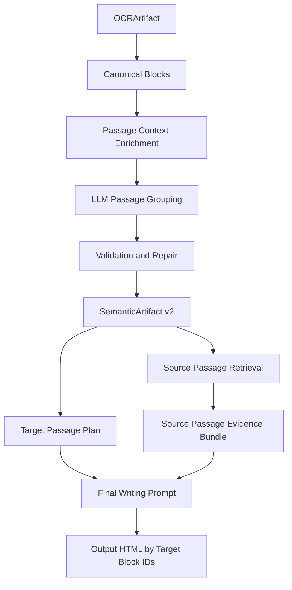
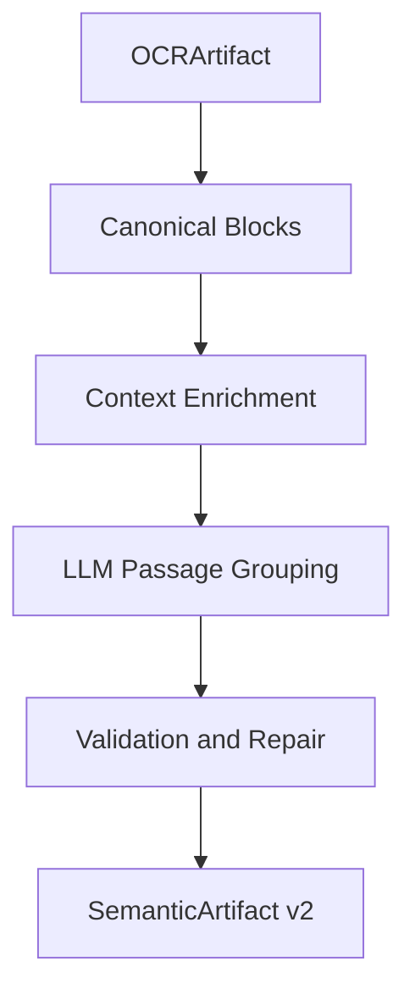
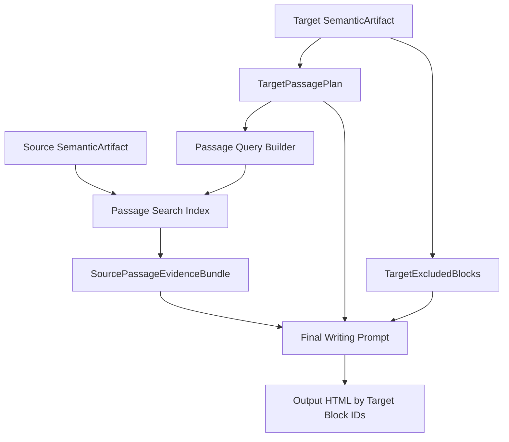
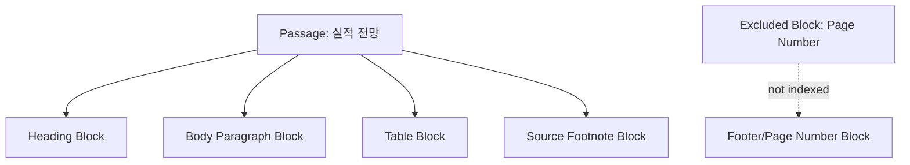
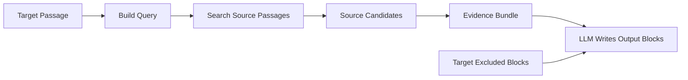

# Passage 기반 Semantic Artifact 구현 설계

## 1. 간단 정리

기존 semantic artifact는 OCR block마다 `generated_role`을 붙이는 방식에 가깝다. 이 방식은 block 하나의 의미를 설명하는 데는 도움이 되지만, 실제 문서 생성에서는 부족하다. 문서 생성은 보통 block 하나를 옮기는 작업이 아니라, 제목, 본문, 표, 캡션, 주석처럼 여러 block이 함께 이루는 의미 단위를 source에서 찾고 target에 맞게 재배치하는 작업이기 때문이다.

따라서 semantic artifact의 중심을 block role에서 passage로 옮긴다.

```text
기존:
OCR block -> generated_role

변경:
OCR block들 -> 의미 단위 passage
```

passage는 검색, 재작성, 근거 전달에 유용한 의미 단위다.

예를 들어 다음 block들은 별도 block이지만 하나의 passage가 될 수 있다.

```text
heading block
body paragraph block
supporting table block
table footnote block
```

이들은 함께 하나의 의미를 전달한다.

```text
"실적 전망 passage"
= 제목 + 설명 문단 + 수치 표 + 자료 주석
```

v1 구현에서는 다음을 하지 않는다.

```text
- affordance 추가 안 함
- confidence 추가 안 함
- passage clustering 추가 안 함
- 도메인 enum 추가 안 함
- non-content를 규칙으로 확정하지 않고 hint로만 제공
```

핵심 목표는 다음 세 가지다.

```text
1. 문서별 semantic 분석은 한 번만 수행한다.
2. source에서는 passage를 retrieval 단위로 사용한다.
3. target에서는 passage를 writing plan 단위로 사용한다.
```

---

## 2. 전체 구조



semantic artifact는 문서 자체에 대한 분석 결과다. source인지 target인지는 artifact 생성 시점에 결정하지 않는다.

```text
문서별 1회 분석:
OCRArtifact -> SemanticArtifact v2

사용 시점별 projection:
SemanticArtifact v2 + source usage -> SourcePassageIndex
SemanticArtifact v2 + target usage -> TargetPassagePlan
```

---

## 3. Passage 분석에 사용할 정보

passage 분석은 LLM이 주도한다. 다만 LLM에게 raw OCR text만 주면 잘못 묶을 가능성이 크다. 따라서 기존 `generated_role` 분석에서 사용하던 context building 방식을 차용해 LLM이 의미 단위를 잘 판단할 수 있도록 풍부한 block context를 제공한다.

### 3.1 Block 기본 정보

각 block에 대해 다음 정보를 제공한다.

```json
{
  "block_id": "page-1-block-7",
  "structural_kind": "table",
  "raw_label": "table",
  "canonical_label": "table",
  "text": "매출액 | 2023 | 2024E ...",
  "bbox_norm": [0.12, 0.42, 0.88, 0.62],
  "reading_order": 7,
  "zone_tags": ["main_body_zone"]
}
```

각 정보의 용도는 다음과 같다.

| 정보                            | 사용 목적                                       |
| ------------------------------- | ----------------------------------------------- |
| `block_id`                      | passage membership을 안정적으로 지정            |
| `structural_kind`               | heading, paragraph, table, image 등 구조 판단   |
| `raw_label` / `canonical_label` | OCR label을 low-level hint로 사용               |
| `text`                          | 의미 판단의 핵심 입력                           |
| `bbox_norm`                     | 같은 영역, 같은 column, header/footer 분리 판단 |
| `reading_order`                 | passage 내부 순서와 boundary 판단               |
| `zone_tags`                     | main body, sidebar, top meta, bottom meta 구분  |

### 3.2 Page Layout Hints

page 단위로 다음 layout hint를 제공한다.

```json
{
  "page": 1,
  "column_count": 2,
  "dominant_layout_pattern": "two_column",
  "text_area_ratio": 0.42,
  "table_area_ratio": 0.18,
  "visual_area_ratio": 0.05
}
```

이 정보는 LLM이 passage boundary를 더 잘 판단하도록 돕는 약한 layout signal이다. `page_archetype`은 v1 passage 설계에서 사용하지 않는다. 현재 `page_archetype`은 금융 리포트/보고서 형태에 치우친 rule-based guess라서 다양한 문서에서 신뢰하기 어렵고, LLM context만 늘릴 가능성이 크다.

예를 들어:

```text
two_column page:
서로 다른 column의 block은 가까워 보여도 다른 passage일 가능성이 높다.

top_meta / bottom_meta:
header/footer나 페이지 정보는 main passage와 분리한다.
```

사용 원칙:

```text
- column_count, dominant_layout_pattern, area ratio는 boundary 판단 보조로만 사용한다.
- page_archetype은 passage grouping 입력에서 제외한다.
- passage membership은 LLM의 의미 판단과 block-level neighbor/attachment 정보가 주도한다.
```

### 3.3 Neighbor Context

각 block 주변의 의미 관계를 제공한다.

```json
{
  "previous_text_blocks": [
    {
      "block_id": "page-1-block-6",
      "text": "매출 성장은 ...",
      "same_column": true
    }
  ],
  "next_text_blocks": [
    {
      "block_id": "page-1-block-8",
      "text": "자료: 회사",
      "same_column": true
    }
  ],
  "nearby_heading_candidates": [
    {
      "block_id": "page-1-block-5",
      "text": "실적 전망",
      "distance": 0.06,
      "same_column": true
    }
  ],
  "nearby_evidence_candidates": [
    {
      "block_id": "page-1-block-7",
      "structural_kind": "table",
      "distance": 0.04
    }
  ]
}
```

이 정보는 다음 판단에 사용된다.

```text
- heading이 어느 paragraph/table을 지배하는지
- table이 직전 paragraph의 근거인지
- footnote/caption이 어느 table/chart에 붙는지
- paragraph가 다음 block과 같은 의미 흐름인지
- 같은 column의 연속 block인지
```

### 3.4 Attachment Hints

attachment hint는 block과 block 사이의 의미적 연결 후보를 LLM에게 보여주는 정보다. passage grouping의 정답이 아니라, LLM이 어떤 block 관계를 유심히 봐야 하는지 알려주는 scaffold다.

필요한 이유:

```text
- table/chart가 직전 paragraph의 근거인지 판단하기 위해
- caption/footnote가 어느 table/chart에 붙는지 판단하기 위해
- heading이 어느 본문 block들을 지배하는지 판단하기 위해
- 같은 column의 연속 block인지, 옆 column의 별도 section인지 구분하기 위해
```

코드는 확정 판단이 아니라 hint만 제공한다.

예:

```json
{
  "attachment_hints": [
    {
      "block_id": "page-1-block-7",
      "hint": "likely_supports_previous_paragraph",
      "target_block_id": "page-1-block-6",
      "reason": "table appears immediately below the paragraph in the same column"
    },
    {
      "block_id": "page-1-block-8",
      "hint": "likely_footnote_for_previous_table",
      "target_block_id": "page-1-block-7",
      "reason": "short text below table starts with source-like wording"
    }
  ]
}
```

LLM은 이 hint를 참고하되, 의미상 맞지 않으면 따르지 않을 수 있다.

생성 방식:

```text
- table/chart/image가 같은 column의 직전 heading/paragraph 아래에 있으면 attachment 후보를 만든다.
- 짧은 text block이 table/chart 바로 위나 아래에 있으면 caption/footnote 후보를 만든다.
- heading 이후 다음 heading 전까지의 같은 column block들은 heading scope 후보로 표시한다.
- top/bottom zone, 반복 text, header/foot label은 non-content hint로 표시한다.
```

### 3.5 Non-content Hints

header, footer, page number, repeated metadata 후보도 전달한다. 단, 이 정보는 제외 여부를 확정하는 규칙이 아니다. 코드는 block이 본문 passage가 아닐 가능성을 알려주는 hint만 만들고, 최종적으로 content passage에 포함할지 `excluded_blocks`로 뺄지는 LLM이 문서 맥락을 보고 판단한다.

```json
{
  "non_content_hints": [
    {
      "block_id": "page-1-block-1",
      "type": "top_margin_repeated_text",
      "reason": "similar text appears at similar top position on multiple pages"
    },
    {
      "block_id": "page-1-block-12",
      "type": "page_number_pattern",
      "reason": "short numeric text appears near the bottom margin"
    }
  ]
}
```

이 정보는 main content passage와 섞이지 않도록 돕지만, 다음 원칙을 지킨다.

```text
- non_content_hints는 weak evidence다.
- hint가 있다고 자동으로 excluded 처리하지 않는다.
- target에서 새 문서에 맞게 작성되어야 할 수 있는 block은 content passage로 남긴다.
- 명백한 OCR 노이즈나 빈 장식 요소를 제외하면, repair 단계가 LLM 판단을 규칙으로 뒤집지 않는다.
```

---

## 4. LLM Passage Grouping

### 4.1 LLM의 역할

LLM은 passage membership을 의미 기준으로 결정한다.

중요한 기준:

```text
- passage는 검색, 재작성, 근거 전달에 유용한 의미 단위다.
- 시각적으로 가까운 것만으로 묶지 않는다.
- 하나의 주장, 설명, 근거 묶음이면 여러 block을 묶는다.
- heading + body + table + caption + footnote가 하나의 의미를 이루면 같은 passage다.
- 반복 header/footer/page number처럼 검색, 재작성, 근거 전달에 유용하지 않은 block은 `excluded_blocks`로 분리할 수 있다.
- 모든 content block은 정확히 하나의 passage에 속해야 한다.
- excluded block은 passage retrieval 단위가 아니지만, target 최종 출력에서는 여전히 처리 대상일 수 있다.
```

### 4.2 Prompt 골격

```text
You group OCR blocks into semantic passages.

A passage is a coherent meaning unit useful for rewriting, retrieval, or evidence transfer.
A passage may include heading, body, table, chart, caption, and footnote blocks if they jointly express one idea.
Do not group blocks only because they are visually close.
Do not merge repeated headers, footers, page numbers, or decorative blocks into main content passages.
Use non_content_hints as weak evidence only.
Do not automatically exclude a block only because it has non_content_hints.
Every content block must appear in exactly one passage.
Return excluded_blocks for blocks that are not useful as retrieval or rewriting units.
If a block may need to be rewritten for the target document, keep it in a content passage.

Return JSON only.
Do not use markdown fences.
Do not invent block ids.
```

### 4.3 LLM 출력

```json
{
  "passages": [
    {
      "block_ids": [
        "page-1-block-5",
        "page-1-block-6",
        "page-1-block-7",
        "page-1-block-8"
      ],
      "title": "실적 전망",
      "summary": "실적 전망을 설명하고 표로 관련 수치를 제시하는 의미 단위.",
      "main_function": "explain_with_supporting_data"
    }
  ],
  "excluded_blocks": [
    {
      "block_id": "page-1-block-12",
      "reason": "page_number"
    }
  ]
}
```

`title`, `summary`, `main_function`, `excluded_blocks.reason`은 도메인 enum이 아니다. 문서마다 자유롭게 생성되는 설명용 text다.

---

## 5. Validation and Repair

LLM이 의미 grouping을 주도하지만, 코드가 구조적으로 깨진 결과를 보정한다.

### 5.1 기본 보정 규칙

```text
- 존재하지 않는 block_id는 제거한다.
- 누락된 content block은 singleton passage로 추가한다.
- 중복된 block은 처음 등장한 passage에만 남긴다.
- passage 내부 block은 reading_order 기준으로 정렬한다.
- 한 block이 passage와 excluded_blocks에 동시에 있으면 passage를 우선한다.
- non_content_hints만으로 block을 강제 제외하지 않는다.
- 너무 큰 passage는 heading boundary 또는 max block count 기준으로 나눈다.
```

기본값:

```text
window scope: page 단위
max blocks per LLM call: 20
max blocks per passage after repair: 8
cross-page passage: v1에서는 금지
non_content_hints: LLM 판단용 weak hint
excluded_blocks: retrieval/writing passage에서는 제외하지만 final output에서는 처리 대상
```

### 5.2 Repair 예시

LLM 출력:

```json
{
  "passages": [
    {
      "block_ids": ["page-1-block-1", "page-1-block-4", "page-1-block-5"],
      "title": "실적 전망",
      "summary": "..."
    }
  ]
}
```

만약 `page-1-block-1`에 반복 header hint가 있더라도, repair는 이것만으로 강제 분리하지 않는다. LLM이 이 block을 문서 제목이나 작성이 필요한 상단 block으로 판단했다면 content passage에 남긴다.

반대로 LLM이 `page-1-block-12`를 page number로 판단해 `excluded_blocks`로 반환했다면 보정 후:

```json
{
  "passages": [
    {
      "block_ids": ["page-1-block-1", "page-1-block-4", "page-1-block-5"],
      "title": "실적 전망",
      "summary": "..."
    }
  ],
  "excluded_blocks": [
    {
      "block_id": "page-1-block-12",
      "reason": "page_number"
    }
  ]
}
```

이 예시에서 `excluded_blocks`는 삭제 대상이 아니다. source retrieval이나 target passage query를 만들 때 쓰지 않는다는 뜻이며, target 최종 HTML을 만들 때는 새 문서 맥락에 맞게 비우거나 수정하거나 유지하도록 final writing prompt에 함께 제공한다.

---

## 6. SemanticArtifact v2 Schema

```json
{
  "schema_version": "semantic-passage-v1",
  "document_profile": {
    "language": "ko",
    "page_count": 3
  },
  "blocks": [
    {
      "block_id": "page-1-block-6",
      "page": 1,
      "reading_order": 6,
      "structural_kind": "paragraph",
      "bbox_norm": [0.12, 0.24, 0.86, 0.34],
      "text": "...",
      "content_status": "content",
      "non_content_hints": [],
      "passage_id": "passage-001"
    },
    {
      "block_id": "page-1-block-12",
      "page": 1,
      "reading_order": 12,
      "structural_kind": "text",
      "bbox_norm": [0.48, 0.95, 0.52, 0.98],
      "text": "3",
      "content_status": "excluded",
      "non_content_hints": [
        {
          "type": "page_number_pattern",
          "reason": "short numeric text appears near the bottom margin"
        }
      ],
      "passage_id": null
    }
  ],
  "passages": [
    {
      "passage_id": "passage-001",
      "page_span": [1, 1],
      "block_ids": [
        "page-1-block-5",
        "page-1-block-6",
        "page-1-block-7"
      ],
      "title": "실적 전망",
      "summary": "실적 전망을 설명하고 관련 표로 근거를 제시한다.",
      "main_function": "explain_with_supporting_data",
      "retrieval_text": "실적 전망 ...",
      "representative_block_id": "page-1-block-5"
    }
  ],
  "excluded_blocks": [
    {
      "block_id": "page-1-block-12",
      "reason": "page_number"
    }
  ],
  "diagnostics": {
    "passage_trace": []
  }
}
```

`retrieval_text`는 source search에 바로 쓰기 위한 text다.

`excluded_blocks`는 passage retrieval과 passage writing plan에서 제외되는 block 목록이다. 삭제하거나 target 원문을 무조건 보존하라는 뜻이 아니다. source에서는 검색 색인에서 제외하고, target에서는 final writing prompt에 포함해 새 문서 맥락에 맞게 비우거나 수정하거나 유지하게 한다.

구성:

```text
passage title
passage summary
main_function
heading text
paragraph preview
table labels
caption/footnote text
```

---

## 7. Source에서 Passage 활용

source 문서에서는 content passage를 검색 단위로 사용한다. `excluded_blocks`는 source search index에 넣지 않는다. excluded block은 검색 질의를 만들거나 근거 후보로 반환하기에 부적합한 block이라는 뜻이며, 원본 artifact에서는 추적용으로 보존한다.

기존 block 검색:

```text
source block 하나가 검색됨
주변 heading/body/table 맥락은 따로 fetch해야 함
```

passage 검색:

```text
heading + body + table + footnote가 함께 검색됨
검색 결과가 바로 근거 묶음이 됨
```

### 7.1 Passage Search Record

검색 record는 다음 정보를 embedding text에 포함한다.

```text
doc_id
page_span
passage_id
passage_title
passage_summary
main_function
block_ids

content:
heading text
paragraph preview
table labels
caption/footnote text
```

`excluded_blocks`의 text, reason, hint는 embedding text에 넣지 않는다. page number, 반복 header/footer, template label 같은 정보가 검색 ranking을 오염시키지 않도록 하기 위해서다.

### 7.2 Search Output

```text
Candidate passage #1
doc_id=1
passage_id=passage-004
page_span=2-2
title=실적 전망
summary=실적 전망과 관련 수치를 설명한다.
block_ids=page-2-block-3,page-2-block-4,page-2-block-5
preview=...
```

기존 block 검색은 fallback으로 유지하지 않는다. v1 passage 전환 이후 source retrieval의 기본 단위는 passage여야 한다. passage artifact가 없으면 기존 block 검색으로 조용히 내려가지 않고, artifact rebuild를 요구하거나 명시적 오류를 내야 한다.

```text
semantic-passage-v1 있음 -> passage 검색
semantic-passage-v1 없음 -> artifact rebuild 필요 / 명시적 오류
```

---

## 8. Target에서 Passage 활용

target 문서에서는 content passage를 writing plan 단위로 사용한다. `excluded_blocks`는 target passage query를 만들거나 source retrieval을 유도하는 데 쓰지 않는다. 하지만 최종 output block에서는 여전히 처리해야 하므로 final writing prompt에 함께 제공한다.

### 8.1 TargetPassagePlan

target semantic artifact, target OCR, target style을 합쳐 다음 계획을 만든다.

```json
{
  "target_passage_id": "target-passage-003",
  "output_block_ids": [
    "output-page-1-block-7",
    "output-page-1-block-8"
  ],
  "source_block_ids": [
    "target-page-1-block-7",
    "target-page-1-block-8"
  ],
  "title": "핵심 설명",
  "summary": "짧은 제목과 본문으로 구성된 설명 passage.",
  "block_layouts": [
    {
      "output_block_id": "output-page-1-block-7",
      "structural_kind": "heading"
    },
    {
      "output_block_id": "output-page-1-block-8",
      "structural_kind": "paragraph"
    }
  ],
  "writing_goal": "source passage 내용을 target passage의 block 구조에 맞게 분배한다."
}
```

### 8.2 TargetExcludedBlocks

target semantic artifact의 `excluded_blocks`는 별도 evidence retrieval을 만들지 않는다. 대신 final writing prompt에 다음처럼 전달한다.

```json
{
  "target_excluded_blocks": [
    {
      "output_block_id": "output-page-1-block-1",
      "source_block_id": "target-page-1-block-1",
      "text": "ABC Securities",
      "reason": "repeated_header_or_template_label"
    },
    {
      "output_block_id": "output-page-1-block-12",
      "source_block_id": "target-page-1-block-12",
      "text": "3",
      "reason": "page_number"
    }
  ]
}
```

처리 원칙:

```text
- target excluded block은 원문을 무조건 유지하지 않는다.
- source retrieval query에는 사용하지 않는다.
- final writing prompt에는 포함한다.
- 최종 LLM이 새 문서 맥락에 맞게 empty / rewrite / keep 중 하나로 처리한다.
- stale template text가 그대로 남지 않도록 명시한다.
```

### 8.3 Final Prompt 구성

최종 LLM prompt에는 다음 네 가지가 들어간다.

```text
1. Target HTML
   layout/style reference

2. TargetPassagePlan
   어떤 target passage에 어떤 구조로 써야 하는지

3. SourcePassageEvidenceBundle
   어떤 source passage를 근거로 쓸지

4. TargetExcludedBlocks
   passage retrieval 단위는 아니지만 최종 HTML에서 처리해야 하는 block
```

LLM은 passage 단위로 내용을 계획하고, 마지막 출력은 기존처럼 target block id별 HTML로 나눈다. 이때 excluded block도 출력 block id가 있으면 반드시 결과에 포함하되, target 원문을 그대로 복사하지 말고 새 문서에 맞지 않으면 비우거나 수정한다.

---

## 9. Source-Target Matching

문서 생성 전 target content passage별 source passage 후보를 찾는다. target `excluded_blocks`는 query 생성에 사용하지 않는다.

```text
for each target passage:
    query = user query + target passage title + target passage summary + structural hints
    source candidates = passage search top-k
    evidence bundle = selected source passages
```

결과:

```json
{
  "target_passage_id": "target-passage-003",
  "query": "사용자 요청 + 핵심 설명 + 짧은 제목과 본문...",
  "source_passage_candidates": [
    {
      "doc_id": 1,
      "passage_id": "passage-004",
      "page_span": [2, 2],
      "title": "실적 전망",
      "summary": "실적 전망과 관련 수치를 설명한다.",
      "block_ids": [
        "page-2-block-3",
        "page-2-block-4"
      ]
    }
  ]
}
```

이 정보는 final writing prompt에 `SourcePassageEvidenceBundle`로 들어간다.

target `excluded_blocks`는 `SourcePassageEvidenceBundle`을 만들지 않고 `TargetExcludedBlocks`로 final writing prompt에만 들어간다.

---

## 10. 단계별 간단 정리

### 10.1 Canonicalize

```text
OCR block을 id, text, bbox, label, reading_order가 있는 canonical block으로 만든다.
```

### 10.2 Enrich Context

```text
주변 heading, previous/next text, table/caption 관계, zone, column, non_content_hints를 붙인다.
```

### 10.3 Group Passages

```text
LLM이 page/window 내 block들을 의미 passage로 묶고 title/summary/function을 생성한다. retrieval/writing 단위로 부적합한 block은 excluded_blocks로 분리할 수 있다.
```

### 10.4 Repair

```text
코드가 누락/중복/잘못된 block id와 구조적으로 깨진 grouping을 보정한다. non_content_hints만으로 LLM 판단을 강제 변경하지 않는다.
```

### 10.5 Index Source

```text
source 문서는 content passage 단위 검색 record로 색인한다. excluded_blocks는 색인하지 않는다.
```

### 10.6 Plan Target

```text
target 문서는 content passage 단위 writing plan으로 변환하고, excluded_blocks는 TargetExcludedBlocks로 따로 넘긴다.
```

### 10.7 Generate

```text
TargetPassagePlan + SourcePassageEvidenceBundle + TargetExcludedBlocks를 사용해 output block HTML을 생성한다.
```

---

## 11. 시각화 자료

### 11.1 Semantic 생성 흐름



### 11.2 생성 활용 흐름



### 11.3 Passage와 Block 관계



### 11.4 Source-Target Matching



---

## 12. 구현 대상 요약

### 12.1 Semantic Artifact

추가할 것:

```text
- schema_version
- document_profile
- blocks with passage_id, content_status, non_content_hints
- passages
- excluded_blocks
- passage_trace
```

v1에서 삭제할 것:

```text
- generated_role 중심 생성 흐름
- domain_role 기반 generation policy
- generic_role/domain_role closed enum을 passage 분석의 핵심 입력으로 쓰는 구조
- generated_parent_role_name / generated_role_level
- role_confidence / semantic_needs_review 기반 accept/reject 정책
- used_for_generation
- 기존 section_id 생성 규칙(report_title/thesis_heading/supporting_argument 중심)
```

삭제하지 않고 재사용할 것:

```text
- OCRArtifact와 CanonicalBlock 생성
- raw_label / canonical_label / text / bbox / reading_order
- text_quality_score
- zone, distance, same-column, nearest heading/evidence 계산 helper
- page width/height, column_count, dominant_layout_pattern, area ratio
- repeating header/footer 후보 탐지
- JSON-only LLM call, parser, validation, trace 저장 패턴
- StyleArtifact와 최종 output block id/rendering 흐름
```

재사용하되 약한 hint로만 쓸 것:

```text
- column_count
- dominant_layout_pattern
- text/table/visual area ratio
```

사용하지 않을 것:

```text
- page_archetype
```

### 12.2 Source Search

변경:

```text
- passage record 우선 생성
- passage title/summary/retrieval_text를 embedding text에 포함
- excluded_blocks는 embedding/index에서 제외
- passage 중심 search output 제공
- v2 passage가 없으면 기존 block record fallback 없이 artifact rebuild 또는 명시적 오류
```

### 12.3 Target Generation

변경:

```text
- target SemanticArtifact 로드
- TargetPassagePlan 생성
- TargetExcludedBlocks 생성
- passage별 source evidence preflight
- final prompt에 TargetPassagePlan, SourcePassageEvidenceBundle, TargetExcludedBlocks 추가
- excluded block은 retrieval query에는 쓰지 않고, final output에서는 새 문서 맥락에 맞게 empty/rewrite/keep 처리
```

---

## 13. Test Plan

### 13.1 Passage Parser

```text
- JSON fence가 있어도 parsing되는지
- invalid JSON이면 명시적 parsing error로 기록되는지
- unknown block_id가 제거되는지
- duplicate block_id가 하나만 남는지
- excluded_blocks가 parsing되는지
```

### 13.2 Repair

```text
- 누락 content block이 singleton passage로 추가되는지
- non_content_hints만으로 block이 강제 excluded 처리되지 않는지
- passage와 excluded_blocks에 동시에 있는 block은 passage가 우선되는지
- max block count 초과 passage가 split되는지
- passage 내부 block order가 정렬되는지
```

### 13.3 Source Retrieval

```text
- passage title/summary/table label이 embedding text에 포함되는지
- excluded_blocks가 embedding text와 search index에 포함되지 않는지
- passage 검색 결과에 passage_id, page_span, block_ids가 표시되는지
- passage artifact가 없으면 기존 block 검색으로 fallback하지 않고 artifact rebuild 또는 명시적 오류가 발생하는지
```

### 13.4 Target Plan

```text
- target passage block_ids가 output-page-x-block-y로 변환되는지
- TargetPassagePlan이 final prompt에 포함되는지
- TargetExcludedBlocks가 final prompt에 포함되는지
- TargetExcludedBlocks가 source retrieval query 생성에는 사용되지 않는지
- source evidence bundle이 target passage별로 생성되는지
```

### 13.5 Integration

```text
- source passage 검색 결과가 heading/body/table을 함께 반환하는지
- target excluded block이 stale template text로 무조건 보존되지 않는지
- final output은 기존 output block id 규칙을 유지하는지
- 기존 rendering flow가 깨지지 않는지
```

---

## 14. Assumptions

```text
- passage 분석은 문서별 1회만 수행한다.
- source/target 용도별로 semantic 분석을 다시 돌리지 않는다.
- v1에서는 cross-page passage를 만들지 않는다.
- v1에서는 passage clustering을 만들지 않는다.
- affordance/confidence는 artifact에 추가하지 않는다.
- page_archetype은 passage grouping 입력에서 제외한다.
- v1 passage 전환 이후 기존 block search fallback은 제거한다.
- non_content_hints는 weak hint이며, LLM의 passage/excluded 판단을 규칙으로 강제하지 않는다.
- target excluded block은 source retrieval에는 쓰지 않지만 final writing prompt에는 포함한다.
- 최종 output HTML과 rendering 방식은 기존 구조를 유지한다.
```
